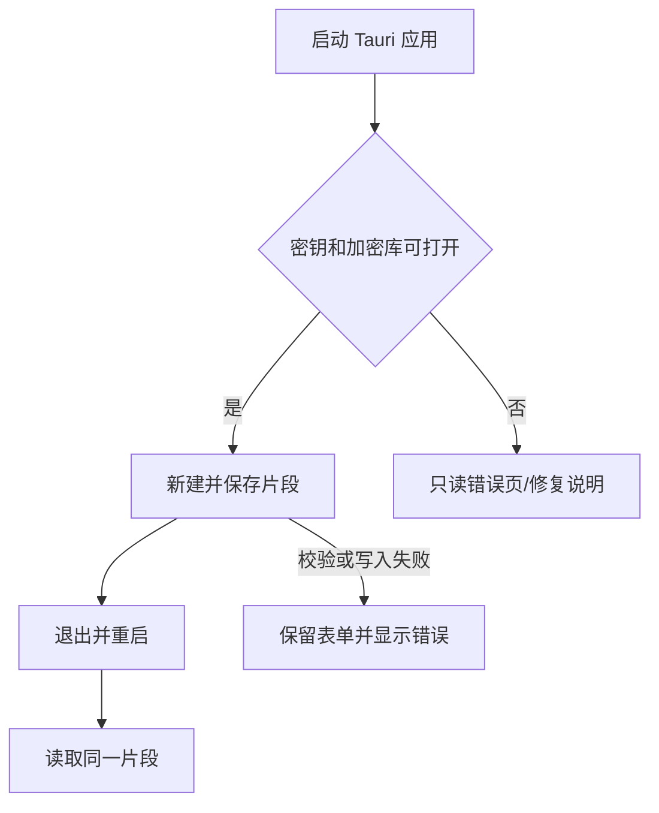

# SPEC-01 安全持久化首条片段

## 基本信息

- 当前状态：`in_qa`
- 关联阶段：Phase 1
- 当前责任角色：`QA`
- 关联 PRD：`FR-SNP-01~03`、`AC-02`、`NFR 11.2/11.3`、`E-02~05/E-12/E-13`
- 前置 Spec：无
- 允许修改：`front-baseline/package*.json`、`front-baseline/src-tauri/**`、创建首条片段所需的 `front-baseline/src/**`、本 spec 与 `master_plan.md`
- 禁止修改：`docs/prds/**`、其他 spec 对应业务、云端/多平台兼容代码

## 背景与成功标准

作为首次启动用户，我希望在桌面应用中创建合法片段，并在完全退出重启后仍能看到它，从而确认数据被安全、可靠地保存在本机。

- [x] Tauri 2 应用在目标 Arch/KDE/X11 启动，并记录非敏感环境版本。
- [x] 首次启动生成 SQLCipher 数据库和独立随机密钥文件，密钥权限严格为 `0600`。
- [x] 用户可创建、读取、编辑一条纯文本片段；自动化重开测试确认内容与元数据持久化。
- [x] 规范化 Key 冲突（含软删除行预留）被数据库唯一约束拒绝，记录数不变。
- [x] 密钥缺失、权限错误、数据库打开/写入失败时不创建明文库，界面保留输入并给出下一步。

## 非目标

不实现检索排序、系统剪贴板、全局快捷键、自动粘贴、完整管理筛选、回收站 UI、导入导出或向导。

## 用户流程

## 接口与数据契约

| IPC / 服务 | 输入 | 成功返回 | 错误码 | 幂等/并发 |
|---|---|---|---|---|
| `snippet_create` | key/title/content/aliases/tags/sensitive/pinned/requestId | 完整 Snippet | `KEY_CONFLICT`,`DB_WRITE_FAILED`,`VALIDATION_FAILED` | 同一 requestId 不重复创建 |
| `snippet_get/list` | id 或基础列表参数 | Snippet/列表 | `DB_OPEN_FAILED` | 只读 |
| `snippet_update` | id/revision/可编辑字段 | 新 revision 的 Snippet | `REVISION_CONFLICT`,`KEY_CONFLICT`,`DB_WRITE_FAILED` | `WHERE id AND revision` |

- Schema v1 使用 PRD 8.1 的全部 Snippet 字段和约束；时间为 ISO 8601 UTC，ID 为 UUID v4。
- Key：trim → 小写 → 连续内部空白变 `-`，只允许 Unicode 字母/数字/`-_.`，长度 1–64。
- `normalizedKey` 建立全表唯一索引；`revision>=1`、`usageCount>=0`。
- Settings Schema v1 可在本 slice 初始化默认值，但不得提前实现设置 UI。
- Schema 建立、创建、编辑分别使用单事务；迁移失败保留原文件。

## 架构与安全

- React 仅调用类型化 Tauri IPC；Rust 分离 command、应用服务、存储仓库。
- SQLite 必须由 SQLCipher 加密；不得以字段自制加密或明文 SQLite 冒充。
- 密钥由 OS CSPRNG 生成，原子创建，拒绝符号链接/宽权限；不得打印密钥、正文、完整标题/别名。
- 数据库打开失败进入只读错误状态，不自动删库、重建或降级。
- UI 以文本节点渲染正文，禁止 `dangerouslySetInnerHTML`。

## 失败场景

| 场景 | 预期 | 错误码 | 原状态 |
|---|---|---|---|
| Key 规范化为空/正文超 100 KB | 字段定位错误，不调用写入 | `VALIDATION_FAILED` | 保留表单 |
| Key 与现有/软删除行冲突 | 拒绝并显示冲突 Key | `KEY_CONFLICT` | 数据不变 |
| revision 已变化 | 提示重新载入，不合并 | `REVISION_CONFLICT` | 数据不变 |
| 密钥缺失、非 `0600`、不可读 | 不打开/创建明文库，显示修复/恢复说明 | `DB_KEY_UNAVAILABLE` | 保留数据库 |
| 磁盘满或事务失败 | 回滚，不显示成功 | `DB_WRITE_FAILED` | 保留表单/原库 |

## 测试与验收

- [x] 单元：Key 边界、UTF-8 字节长度、aliases/tags 去重与上限、不可变字段。
- [x] 集成：SQLCipher 文件不能被普通 SQLite 读取；密钥正确可重开；错误密钥/权限拒绝；迁移和事务回滚。
- [x] 集成：重复 requestId、唯一索引含软删除、revision 冲突。
- [ ] 手动：创建含换行/Emoji 的片段，完全退出重启后核对；执行 AC-02（留给 QA 实机操作）。
- [x] 记录目标机包快照、内核、Plasma、Qt、X11、Rust、Node 与实际构建命令。

## Coder 实现与验收记录（2026-08-01）

- 实现：建立 Tauri 2 桌面壳；React 通过类型化 IPC 调用 Rust command → service → repository；UI 只展示本 slice 的创建、读取、编辑和只读启动错误状态。
- 存储：Schema v1 完整保存 PRD 8.1 Snippet 字段；所有用户值使用参数化 SQL；Schema、创建和编辑各自使用事务；`normalized_key` 为包含软删除行的全表唯一索引。
- 加密：`rusqlite 0.37` 使用 `bundled-sqlcipher-vendored-openssl`，SQLCipher 随 Rust 构建静态编入；发布二进制没有对 SQLCipher/SQLite/OpenSSL 的直接动态依赖（`readelf -d`），GTK/WebKit 仍使用 Arch 系统运行库。
- 密钥：OS CSPRNG 生成 32 bytes，配置目录中 `create_new + file fsync + parent-directory fsync` 后才创建数据库；以 `O_NOFOLLOW` 打开并从文件描述符检查普通文件、当前用户所有权、精确 `0600` 和固定长度；缺失、符号链接、宽权限、错误密钥均拒绝打开原库。
- 审查修复：幂等记录绑定规范化请求 SHA-256，复用 requestId 但内容不同时保留草稿并拒绝；revision 冲突提供明确确认后重载；保存期间禁用表单与导航；CRUD 失败仅以时间、版本、操作名和错误码写入 `0600` 本地诊断日志，不记录用户数据。
- 自动化：`cargo fmt --all -- --check && cargo test && cargo clippy --all-targets -- -D warnings && cargo build --release`，16 tests passed；覆盖普通 SQLite 拒读、正确/错误密钥重开、配置/数据目录分离、符号链接/权限、精确 100 KB 边界、旧 Schema v1 幂等记录指纹迁移与失败保留、创建/更新事务回滚、幂等指纹、软删除 Key 冲突和 revision 冲突。
- 构建：`npm run build` passed；`npm run tauri:build` passed；最终 Rust release build passed；产物为 `front-baseline/src-tauri/target/release/searchis`。
- 启动烟测：隔离 XDG 目录运行最终发布二进制 6 秒，进程持续存活；密钥位于 config、数据库位于 data、诊断日志已创建；密钥为 32-byte `0600`；普通 `/usr/bin/sqlite3` 读取失败；日志仅记录时间、版本、操作、错误码及 `linux/x86_64/KDE/x11` 等非敏感环境信息。
- 目标环境：Arch snapshot 2026-08-01T06:42:43Z，1877 packages，SHA-256 `fd06a29677e503bb8e5d3b284c9ebea968cc710d4a196bb12682b7e983627f9c`；Linux `7.0.12-arch1-1`；Plasma `6.7.0`；Qt `6.11.1`；X11；Rust/Cargo `1.96.1`；Node `26.3.1`；npm `11.16.0`；SQLite `3.53.2-1`；WebKitGTK `2.52.4-1`；GTK3 `3.24.52-1`；OpenSSL `3.6.3-1`；Xorg Server `21.1.23-1`。
- 残余验收：尚未由人工在窗口中执行“换行/Emoji 创建 → 完全退出 → 重启 → 编辑”及 AC-02；QA 必须执行后再决定 `passed`。

## QA Result

- Status：`conditional_pass`
- Owner Back：`QA → Coder`（清理后无需回 QA；人工重启验收由 QA 执行）
- Date：2026-08-01
- Automated Checks：`npm run build` ✅、`cargo test` 16/16 ✅、`cargo fmt --check` ✅、`cargo clippy -- -D warnings` ✅

### Findings

| # | 严重度 | 描述 |
|---|---|---|
| F1 | 低 | 旧基线文件未清理：`src/components/*`(6)、`src/data/initialSnippets.ts`、`src/types/snippet.ts` 为死代码，新 App.tsx 不再引用 |
| F2 | 低 | 死依赖：`canvas-confetti` 在 package.json 中保留但不再使用 |
| F3 | 低 | `useEffect` (App.tsx:35) 异步 list 调用无清理逻辑，Strict Mode 下可能双重请求 |
| F4 | 信息 | `storage.rs` list() 查询未过滤 `deleted_at IS NULL`；SPEC-05 需更新此查询 |

### Risks

| # | 风险 |
|---|---|
| R1 | 无前端自动化测试框架（AGENT.md §7.2 已记录） |
| R2 | `selectSnippet` 未在 useEffect 依赖数组中声明（无 ESLint 暂不报警） |
| R3 | 旧组件文件中 macOS 键位文案残留，虽不加载但可能误导后续开发者 |

### Missing Tests

| # | 测试项 | 备注 |
|---|---|---|
| MT1 | 手动重启持久化：换行/Emoji → 完全退出 → 重启 → 编辑 | spec 声明留给 QA 实机操作 |
| MT2 | 前端组件测试 | 测试框架未配置 |
| MT3 | `list()` 排序验证 | Rust 侧无独立排序测试 |

### Required Fixes

- F1/F2 建议 Coder 在下一迭代中清理，不阻塞 SPEC-01 功能完整性
- 无强制修复项

### Retest Criteria

- 人工重启验收（MT1 + AC-02）通过后可升级为 `passed`
- F1/F2 清理后无需重新 QA

## 完成定义

功能、失败路径和测试均完成；SQLCipher 与 `0600` 有证据；QA `passed`；实现记录和 `master_plan.md` 已回写。