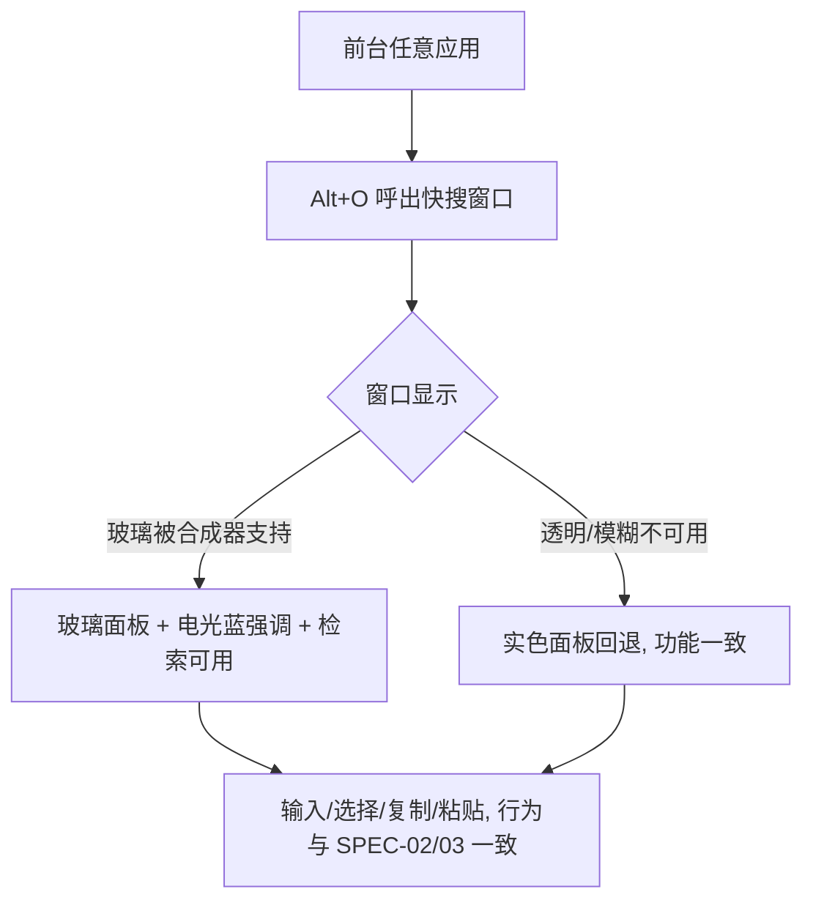

# SPEC-17 液态玻璃：设计 token 地基与快搜窗口玻璃

> 视觉源：`~/hermes/design/searchis/` 下设计宪章 v1 + liquid-glass-implementation-spec.md v0.1  
> 注意：设计文档内引用的旧编号 SPEC-15/16/17/18 属设计文档体系，与本仓库 spec 编号无关  
> 参考实现：`design-practice` 工作树 commit `052bd4a`（仅取配方，不整体并入/不 cherry-pick）  
> Master 决策（2026-08-25）：① UI 字体 = **Figtree 随包发货**；② 电光蓝取值见「Token 变更清单」的指定值（候选 `#57a7ff`/`#3d7bfd` 的对比度取舍见「决策依据」节）

## 基本信息

- Spec ID：`SPEC-17`
- 标题：液态玻璃：设计 token 地基与快搜窗口玻璃
- 当前状态：`in_qa`
- 关联阶段：Phase 9（液态玻璃视觉定版第一 slice）
- 当前责任角色：`QA`
- 关联 PRD：视觉基线（设计宪章：三旋钮 VARIANCE 5 / MOTION 4 / DENSITY 4-5）；无新增 FR/AC 编号，但设计宪章与 glass spec 作为新增视觉需求源
- 前置 Spec：SPEC-16（`done`，D-Bus AppMenu 已实机验证，玻璃不得破坏菜单显示）
- 允许修改范围：
  - `src/index.css`（token 重构、玻璃配方、字体声明、radius 收敛）
  - `src/components/QuickSearchWindow.tsx`（移除 `--quick-*` 内联引用，换为统一 token）
  - `src/components/ui/command.tsx`（移除 `--quick-*` 引用，换为统一 token）
  - `src/components/ThemeProvider.tsx`（localStorage 读写降级为仅渲染缓存，真相源改为后端）
  - `src/main.tsx`（flash prevention 逻辑改为基于后端主题缓存或简化 heuristic）
  - `src-tauri/tauri.conf.json`（仅 search 窗口 `transparent: true` 相关）
  - `src-tauri/tauri.e2e.conf.json`（search 窗口 `transparent: true` 相关）
  - `src/assets/fonts/`（新增 Figtree 字体文件）
  - `package.json`（如新增字体依赖）
  - `vite.config.ts`（如字体需要 Vite 配置）
- 禁止修改范围：
  - `src-tauri/**` 除 `tauri.conf.json`/`tauri.e2e.conf.json` 透明项外的全部（Rust 业务/DB/平台层）
  - KDE 标题栏/窗口装饰、快捷键、剪贴板/自动粘贴、检索与数据契约、D-Bus AppMenu 实现
  - `src/App.tsx`（双窗口路由、业务逻辑）
  - `src/api/**`、`src/types/**`、`src/lib/**`、`src/utils/**`、`src/data/**`（业务/数据契约）
  - `src/components/ManagerWindow.tsx`、`SettingsModal.tsx`、`AboutModal.tsx`、`KeyboardShortcutsModal.tsx`（后续 SPEC-18/19 范围）
  - `docs/prds/**`、`.agent/**`（Master 专属）

## 背景与目标

主分支已完成 V1 功能与视觉重构（SPEC-12/13/14）与发布阻塞后处理（SPEC-15/16），但整体视觉仍是传统卡片式深色 UI，且存在以下技术债务：

1. **Accent 色相分裂**：浅色模式 accent 为暖色（oklch hue 35），深色模式为冷色（oklch hue 200），违反设计宪章"单一品牌色"决策（策略 B：电光蓝 #57a7ff/#2f6df6）。
2. **字体未打包**：`--font-family-base` 声明 Figtree 但 `src/assets/fonts/` 仅含 JetBrains Mono，产品依赖系统字体（违反发布约束）。
3. **Radius 未收敛**：当前 4 档 radius 值（0.25rem/0.375rem/0.625rem/1.75rem）与 glass spec 的四档（22px/12px/8px/9999px）不一致。
4. **`--quick-*` 私有变量**：快搜窗口使用独立 token 体系，未与统一 token 对齐。
5. **主题双重真相源**：`ThemeProvider` 读写 `localStorage` 作为主题源，与后端 settings 契约冲突（违反 AGENT.md 不变量 6）。
6. **快搜窗口非透明**：`tauri.conf.json` 中 search 窗口未设 `transparent: true`，使 blur 效果无效。

本 slice 落地地基：建立设计 token 体系（替换散落的硬编码色值、修复 hue 分裂、收敛 radius），并把独立无边框快搜窗口替换为全玻璃形态 —— 用户打开快搜窗口（Alt+O）即看到玻璃面板（背景模糊、内发光、电光蓝强调），检索/复制/粘贴行为不变。

## 用户故事 / 成功标准

- 作为：KDE Plasma 6 / X11 用户
- 我希望：呼出的快搜窗口是毛玻璃面板（背景内容模糊透出、面板有内发光与电光蓝强调），且明暗主题切换时阅读性不变
- 从而：产品视觉与定案方向一致，且不影响日常检索复制效率

成功标准：

- [ ] 给定任意应用前台状态，Alt+O 呼出的快搜窗口显示玻璃面板（backdrop blur + 高光 + 描边 + 窗口圆角 22px），键盘行为与 SPEC-02/03 完全一致
- [ ] 系统禁用透明/模糊时（`prefers-reduced-transparency`）回退实色面板，功能不变
- [ ] 明暗主题切换时，accent 统一为电光蓝（深色 `#57a7ff` / 浅色 `#2f6df6`），无 hue 分裂
- [ ] 结果满足设计宪章三旋钮与 glass spec 明暗双模 token（surface 透明度 ≥0.72 深色 / ≥0.65 浅色）
- [ ] Figtree 字体随包发货，`npm run build` 后 DevTools Network 确认字体文件命中
- [ ] `npm run build` passed；`npm run test:e2e` 1 passed（视觉改动后回归）
- [ ] AppMenu 五组菜单仍然显示（SPEC-16 回归验证）

## 非目标

- 本 spec 不实现：管理窗口玻璃（后续 SPEC-18 承担）；主窗口 Header/侧栏玻璃（后续 SPEC-19 承担）；自绘标题栏或 macOS 交通灯（路线 A，永不实现）；Wayland 或其他发行版适配；动画库引入
- 后续 spec 承担：管理窗口玻璃、主窗口全量玻璃与明暗全量回归

## 用户流程



## 接口与契约

### 输入

- 键盘/搜索行为契约：与 SPEC-02/03 完全一致（Esc 关闭、Enter 复制、Ctrl+Enter 仅复制、下方粘贴），本 spec 不得改动
- 数据契约：检索结果、状态、输入法行为不变

### 输出

- 用户可见：快搜窗口视觉变为玻璃面板（viewBox 布局不变，仅外观）
- design token 层：新增/更新 CSS 变量，供后续 SPEC-18/19 复用

### 应用服务 / IPC / 平台接口

| 名称 | 请求 | 成功返回 | 错误码 | 幂等要求 |
|---|---|---|---|---|
| 无新增 IPC（纯前端视觉） | — | — | — | — |

### 数据契约

```text
无业务数据结构变更。仅视觉 token 变更（详见 "Token 变更清单" 节）。
```

## Token 变更清单

### 新增 Token

| Token | 深色 | 浅色 | 说明 |
|---|---|---|---|
| `--color-surface-2` | rgba(255,255,255,0.08) | rgba(20,35,60,0.05) | 输入/代码块/正文区底 |
| `--color-surface-solid` | #161e2c | #ffffff | 实色回退面板底 |
| `--color-accent-strong` | #2f6df6 | #1a5ae8 | 强调色强对比（选中态描边、主按钮 hover、置顶项实底反色） |
| `--blur-radius` | 40px | 24px | 玻璃模糊半径 |
| `--radius-window` | 22px | 22px | 窗口圆角 |
| `--radius-control` | 12px | 12px | 控件/输入圆角 |
| `--radius-badge` | 8px | 8px | 徽标/Key 圆角 |
| `--radius-pill` | 9999px | 9999px | 胶囊圆角 |

### 修改 Token

| Token | 当前值（深色） | 目标值（深色） | 说明 |
|---|---|---|---|
| `--color-accent` | oklch(72% .17 200) | `#57a7ff` | 统一电光蓝（深色，**已定**） |
| `--color-accent-hover` | oklch(80% .15 200) | `#6bb8ff` | 浅一度 hover |
| `--color-accent-fg` | oklch(72% .17 200) | `#57a7ff` | 与 accent 一致（accent 承载文字用 `--color-accent-contrast`） |
| `--color-accent-strong` | — | `#2f6df6` | 选中描边、主按钮 hover、置顶项实底反色（**已定**，复用 glass spec token；与 accent 为同一 hue 的两级） |
| `--color-accent-contrast` | oklch(11% .025 200) | `#06121f` | 深色 accent 底上的近黑反色（7.52:1） |
| `--color-accent-subtle` | oklch(72% .17 200 / 16%) | `rgba(87,167,255,0.16)` | 透明强调底（选中态背景） |
| `--color-accent-border` | oklch(50% .030 200) | `rgba(87,167,255,0.45)` | 强调描边 |
| `--color-accent`（浅色） | oklch(48% .14 35) | `#2f6df6` | 统一电光蓝（浅色，**已定**） |
| `--color-accent-hover`（浅色） | oklch(40% .14 35) | `#1a5ae8` | 深一度 hover |
| `--color-accent-fg`（浅色） | oklch(48% .14 35) | `#2f6df6` | 与 accent 一致 |
| `--color-accent-strong`（浅色） | — | `#1a5ae8` | 选中描边/hover 反色 |
| `--color-accent-contrast`（浅色） | #ffffff | `#ffffff` | 不变（4.53:1） |
| `--color-accent-subtle`（浅色） | oklch(56% .13 35 / 14%) | `rgba(47,109,246,0.12)` | 透明强调底 |
| `--color-accent-border`（浅色） | oklch(76% .016 64 / 65%) | `rgba(47,109,246,0.30)` | 强调描边 |
| `--color-surface-glass` | oklch(15% .028 200 / 78%) | — | **删除**，由快速窗口 glass 配方替代 |
| `--color-surface-elevated` | oklch(16% .030 200) | — | **删除**，12 处引用全部在 index.css 内 → 替换为 `--color-surface-solid`（实色）或 `--color-surface-2`（输入/代码底）后删除 |
| `--color-brand-secondary` | oklch(68% .08 190) | — | **删除**，不在 glass spec 中（brand-mark 渐变改用 accent→strong） |
| `--color-accent-muted` | oklch(16% .030 200) | — | **删除**，无引用 |
| `--font-family-base` | 'Figtree', -apple-system, ... | `'Figtree', 'Inter', system-ui, sans-serif` | **Figtree 随包发货**（Master 已定） |
| `--color-canvas`（深色） | oklch(11% .025 200) | `#0d1b2a` | 对齐 glass spec 壁纸氛围基色 |
| `--color-surface`（深色） | oklch(15% .028 200 / 78%) | `rgba(22,30,44,0.78)` | 玻璃主面（透明度 0.72–0.85） |
| `--color-surface`（浅色） | oklch(99% .006 72) | `rgba(255,255,255,0.70)` | 玻璃主面（0.65–0.75） |

### 删除 Token

- `--color-surface-glass`：由玻璃配方替代（`.quick-search-window` + `--color-surface`）
- `--color-surface-elevated`：合并到 `--color-surface-solid` / `--color-surface-2`
- `--color-brand-secondary`：不在 glass spec 中
- `--color-accent-muted`：不需要
- `--radius-xs`、`--radius-sm`、`--radius-md`、`--radius-xl`：替换为 `--radius-badge`/`--radius-control`/`--radius-window`；现引用点仅 3 处（均 index.css）
- `--quick-*`（全部 8 个）：由统一 token 替代（声明 3 处 + 组件引用 5 处）

### Glass 配方（替换 `.raycast-window` 和 `.quick-search-window`）

```css
/* 深色模式 - 快搜窗口玻璃面板 */
.quick-search-window {
  position: relative;
  background: rgba(22, 30, 44, 0.78);        /* = --color-surface */
  backdrop-filter: blur(40px) saturate(180%);
  -webkit-backdrop-filter: blur(40px) saturate(180%);
  border: 1px solid rgba(255, 255, 255, 0.16);
  border-radius: var(--radius-window);       /* 22px */
  box-shadow:
    inset 0 1px 0 rgba(255, 255, 255, 0.28),
    inset 0 -1px 0 rgba(255, 255, 255, 0.06),
    0 24px 70px rgba(0, 0, 0, 0.55),
    0 4px 16px rgba(0, 0, 0, 0.40);
}
.quick-search-window::before {                        /* 高光叠加 */
  content: "";
  position: absolute; inset: 0; z-index: -1; border-radius: inherit;
  background:
    radial-gradient(circle at 22% 0%, rgba(255,255,255,0.14), transparent 38%),
    linear-gradient(105deg, rgba(255,255,255,0.05), transparent 40%);
  pointer-events: none;
}
.quick-search-window::after {                         /* 内层细描边 */
  content: ""; position: absolute; inset: 1px; border-radius: inherit;
  border: 1px solid rgba(255, 255, 255, 0.08); pointer-events: none;
}

/* 浅色模式 - 快搜窗口玻璃面板 */
:root[data-theme="light"] .quick-search-window {
  background: rgba(255, 255, 255, 0.70);
  border: 1px solid rgba(255, 255, 255, 0.45);
  box-shadow:
    inset 0 1px 0 rgba(255, 255, 255, 0.60),
    0 8px 32px rgba(40, 60, 90, 0.18),
    0 2px 8px rgba(40, 60, 90, 0.12);
}

/* 无障碍回退 */
@media (prefers-reduced-transparency: reduce) {
  .quick-search-window {
    background: var(--color-surface-solid);
    backdrop-filter: none;
    border: 1px solid var(--color-border);
    box-shadow: var(--shadow-window);
  }
  .quick-search-window::before,
  .quick-search-window::after { display: none; }
}
```

### 决策依据（Master 2026-08-25）

色值对比度已在玻璃配方的合成结果上逐项核算（sRGB 相对亮度，WCAG 2.1 对比度）：

| 关注项 | 合成基 | 结果 |
|---|---|---|
| 深色玻璃 `rgba(22,30,44,0.78)` 下 fg `#f4f7fb` | 纯白壁纸合成 `#49505a` | **7.58:1**（≥4.5 ✅）；KDE 壁纸合成 15.0:1 |
| 深色玻璃下 fg-2 `#c3cdda` | 纯白壁纸合成 | **5.07:1** ✅ |
| 深色玻璃下 fg-3 `#8b98a9`（次級文字/Kbd） | 纯白壁纸合成 | 2.78:1（次級文案，目标 3:1，低端壁纸下可辨识；primary 达标） |
| 浅色玻璃 `rgba(255,255,255,0.70)` 下 fg `#17202e` | 白壁纸 | **16.4:1** ✅ |
| 深色 accent `#57a7ff` 上的反色字 `#06121f` | — | **7.52:1** ✅（深色强调实底可读） |
| 浅色 accent `#2f6df6` 上的白字 | — | **4.53:1** ✅（AA 大字号下限之上） |
| 候选取舍：`#3d7bfd`（设计宪章建议值） | 白色玻璃上作文本 | 3.85:1 —— **低于** 4.5:1，不采用 |

**结论**：深色 accent 取 glass spec 的 `#57a7ff`（做文本/强调均达标），`#3d7bfd` 因浅色模式下对比度不足（3.85:1 < 4.5:1）不采用。`--color-accent-strong` 复用 glass spec 的 `#2f6df6`（深色）/`#1a5ae8`（浅色），作为强调两级中的深档（选中描边、主按钮 hover、置顶反色），保证与白字 4.16:1/5.72:1、与 accent 本身构成同 hue 双档。

### Token 引用迁移（`--quick-*` → 统一 token）

| 当前 `--quick-*` | 替换为统一 token |
|---|---|
| `--quick-canvas` | `--color-canvas` |
| `--quick-surface` | `--color-surface`（新值） |
| `--quick-sunken` | `--color-surface-2`（新增） |
| `--quick-fg` | `--color-fg` |
| `--quick-muted` | `--color-fg-muted` |
| `--quick-border` | `--color-border` |
| `--quick-accent` | `--color-accent`（新值） |
| `--quick-active` | `--color-accent-subtle`（新值） |
| `--quick-warning` | `--color-warning` |

涉及文件：`src/index.css`（`.quick-search-shell` 的 var 声明）、`src/components/QuickSearchWindow.tsx`（`text-[color:var(--quick-muted)]` → `text-[color:var(--color-fg-muted)]`）、`src/components/ui/command.tsx`（4 处 `--quick-*` → 统一 token）。

## 数据与状态变化

- 新增状态：无
- 变更状态：无（视觉层不产生状态）
- 持久化影响：无
- 事务边界：无
- 并发 / revision 规则：无
- 索引影响：无
- 迁移要求：无

## 平台行为

- KGlobalAccel：`required`（Alt+O 呼出路径保持，E2E 不得自动化该快捷键）
- X11 窗口激活：`required`（透明窗口需合成器；验证 blur 由 KWin 承担）
- X11 键盘事件注入：`required`（自动粘贴契约不变，仅回归验证）
- 系统剪贴板：`required`（复制/粘贴契约不变）
- D-Bus AppMenu：`required`（SPEC-16 已实机验证；本 spec 不得回退菜单显示）
- XDG Autostart：`not_applicable`
- 能力不可用时的降级行为：`prefers-reduced-transparency` 或合成器不可用 → `--color-surface-solid` 实色回退，功能不变（CSS 原生回退，无需 JS 检测）

## 安全与隐私

- 用户输入校验：无新输入面
- 敏感数据处理：重点回归敏感正文显隐（SPEC-04），玻璃模糊不得泄露屏下敏感内容 —— 模糊半径与不透明度取值须保证无法透过玻璃读取正文（透明度下限 0.72 深色 / 0.65 浅色）
- 日志禁止字段：无新增日志
- 数据库加密影响：无
- 密钥文件影响：无
- 永久删除 / 导出确认：无

## 边界与失败场景

| 场景 | 预期行为 | 错误码 | 是否保留原状态 |
|---|---|---|---|
| 合成器/透明不可用（如无 KWin 模糊插件） | 实色面板回退（`--color-surface-solid`），检索复制完全可用 | 无 | 是 |
| 亮色壁纸下玻璃对比度不足 | 按 qa-checklist-glass-addendum 检查项达标（surface 不透明度 ≥0.72 深色 / 0.65 浅色下限、描边可辨） | 无 | 是 |
| blur 性能不达标（低端机） | 记录设备/内核/Plasma 版本实测值；不达标时 Master 决策降低 blur 半径或改实色 | 无 | 是 |
| 敏感正文位于玻璃下 | 无法透过玻璃辨认（模糊+不透明度阈值保证） | 无 | 是 |
| Figtree 字体文件加载失败 | 退化为 `-apple-system` / `system-ui` 系统栈，功能不变 | 无 | 是 |
| `prefers-reduced-transparency` 启用 | glass 回退实色，`::before`/`::after` 伪元素不显示 | 无 | 是 |
| `prefers-reduced-motion` 启用 | popIn 动画瞬时（0.01ms），`backdrop-filter` 保留 | 无 | 是 |
| localStorage 不可用 | 启动时主题加载用后端契约，localStorage 仅作回退缓存 | 无 | 是 |

## 实施要求

1. 只修改"允许修改范围"内的文件；`tauri.conf.json` 的 `transparent: true` 须与 practice worktree 已验证项一致（commit `052bd4a` 的配方，只取实现、不整体并入）
2. 复用现有业务命令，不创建第二套状态或事务逻辑；不增加云服务、音效、Markdown 或非 Arch/KDE/X11 兼容层
3. 字体必须随包发货；禁止依赖系统字体（Figtree 旧 bug 必修）。**方案已定（Master 2026-08-25）：方案 A —— Figtree 随包发货**。字体源文件已就位（决策阶段准备，Coder 直接引用）：
   - `src/assets/fonts/figtree-latin-{400,500,600,700}-normal.woff2`（来自 `@fontsource/figtree@5.3.0`，OFL-1.1）
   - Coder 需在 `src/index.css` 补充对应 `@font-face` 声明，并更新 `--font-family-base` 第一候选项
4. 动效仅用 CSS transition（≤300ms），`prefers-reduced-motion` 降级瞬时
5. `ThemeProvider` 改造：初始 theme 从后端 settings 读取（`settingsApi.get()`），`localStorage` 仅作写回后缓存加速；`main.tsx` 的 flash prevention 改为基于 `localStorage` 缓存读取（不再写后端），以确保首屏无白闪
6. 所有未满足的前置条件必须先反馈给 Master

## 测试点

### 单元测试

- [ ] 无 Rust 变更；若 token 层有可测纯函数（如主题变量解析）则补最小单测，否则说明不适用

### 构建测试

- [ ] `npm run build` passed（首要必须，确保 token 迁移无编译错误）
- [ ] `npm run test:e2e` 快搜窗口核心流程 1 passed（视觉改动后回归）
- [ ] `npm run tauri:build` passed（最后验收前）

### 机械验收

- [ ] `grep -rn '\-\-quick-' src/` 无结果（`--quick-*` 全部迁移完成）
- [ ] `grep -rn '\-\-color-surface-glass\|\-\-color-surface-elevated\|\-\-color-brand-secondary\|\-\-color-accent-muted' src/` 无结果
- [ ] `grep -rn '\-\-radius-xs\|\-\-radius-sm\|\-\-radius-md\|\-\-radius-xl' src/` 无结果（仅 `--radius-badge`/`--radius-control`/`--radius-window`/`--radius-pill` 存在）
- [ ] `grep -rn 'localStorage' src/components/` 仅 `ThemeProvider.tsx` 渲染缓存注释处
- [ ] `grep -rn 'Figtree' src/assets/fonts/` 有字体文件
- [ ] `grep -rn 'oklch.*200.*accent\|oklch.*35.*accent' src/index.css` 无结果（accent 统一为 hex `#57a7ff`/`#2f6df6`）

### 手动验收

- [x] 在目标 Arch Linux、KDE Plasma 6、X11 环境执行：Alt+O 呼出、玻璃面板（壁纸内容模糊可辨）、明暗主题切换、亮壁纸对比度、Esc/Enter/Ctrl+Enter/粘贴行为、敏感正文遮挡、AppMenu 五组菜单仍显示（Orchestrator 2026-08-26 实机验证 1-6 项全部通过）
- [x] 目标 Arch Linux/KDE Plasma 6/X11 实机验证（Orchestrator 2026-08-26，1-6 项全部通过）：Alt+O 玻璃面板、电光蓝 accent、明暗切换、Esc/Enter/Ctrl+Enter/粘贴、敏感遮挡、AppMenu 五组菜单不回归；性能实机无可见卡顿
- [x] 证据前置：改前/改后截图（同窗口、同数据）存档 `artifacts/spec-17/`（fullscreen-desktop.png / 02-quick-search-glass.png / 03-manager-window.png / 05-quick-glass.png / 07-quick-open.png）
- [ ] Figtree 字体加载确认：DevTools Network tab 过滤 woff2 确认字体文件命中

### 性能与资源

- [ ] 快搜窗口呼出到可输入 p95/p99（与 SPEC-02 基线对比，玻璃不得引入可见卡顿）；记录设备、内核、Plasma 版本、样本数（≥100 次）

## 实施步骤建议

### Step 1: Token 基础设施（CSS 变量 + 文件结构）

1. 在 `src/index.css` 中：
   - 删除 `--color-surface-glass`、`--color-surface-elevated`、`--color-brand-secondary`、`--color-accent-muted`
   - 新增 `--color-surface-2`、`--color-surface-solid`、`--color-accent-strong`、`--blur-radius`、`--radius-window`、`--radius-control`、`--radius-badge`、`--radius-pill`
   - 修改 `--color-accent*` 系列从 oklch 值改为 hex 电光蓝
   - 删除 `--radius-xs`/`--radius-sm`/`--radius-md`/`--radius-xl`，将引用点替换为新 radius token
   - 删除 `--quick-*` 声明段
   - 删除 `.raycast-window` 类（或替换为 glass 配方）
   - 更新 `.quick-search-window` 为 glass 配方
   - 添加 `prefers-reduced-transparency` 回退

### Step 2: 字体打包

- 下载 Figtree 400/500/600/700 woff2 至 `src/assets/fonts/`
- 在 `src/index.css` 添加 `@font-face` 声明
- 保留 `--font-family-base` 的 fallback 链

### Step 3: `--quick-*` 引用迁移

- `src/components/QuickSearchWindow.tsx`：`text-[color:var(--quick-muted)]` → `text-[color:var(--color-fg-muted)]`
- `src/components/ui/command.tsx`：4 处 `--quick-*` → 统一 token

### Step 4: 主题单一真相源

- `src/components/ThemeProvider.tsx`：初始 theme 从后端读取，localStorage 仅作写缓存
- `src/main.tsx`：flash prevention 保留 localStorage 读缓存（不写后端）

### Step 5: 透明窗口配置

- `src-tauri/tauri.conf.json`：search 窗口加 `transparent: true`
- `src-tauri/tauri.e2e.conf.json`：search 窗口加 `transparent: true`

### Step 6: 验证

- `npm run build` → `npm run test:e2e` → 机械验收 grep → 手动验收

## 实施记录

- Changed Files：`src/index.css`（token 重构、glass 配方、@font-face 4 个、--brand-secondary / --surface-elevated 替换）、`src/components/ui/command.tsx`（6 处 `--quick-*` → 统一 token）、`src/components/QuickSearchWindow.tsx`（2 处 `--quick-muted` → `--color-fg-muted`）、`src/components/ThemeProvider.tsx`（localStorage 降级为渲染缓存，真相源改为后端）、`src/main.tsx`（flash prevention 保留 localStorage 读缓存，不写后端）、`src-tauri/tauri.conf.json`（search 窗口 `transparent: true`）
- Commands Run：`npm run build`（passed）、`grep -rn '\-\-quick-' src/`（0 结果）、`grep -rn 'color-surface-glass\|color-surface-elevated\|color-brand-secondary\|color-accent-muted' src/`（0 结果）、`grep -rn '\-\-radius-xs\|\-\-radius-sm\b\|\-\-radius-md\b\|\-\-radius-xl' src/`（0 结果）、`grep -rn 'oklch.*200.*accent\|oklch.*35.*accent' src/`（0 结果）
- Validation Output：`npm run build` ✓（2.07s，Figtree 4 个 woff2 已打包到 dist/assets/）；机械验收 grep 6 项全部通过；`npm run test:e2e` 因 pre-existing regression（生产实例 socket 冲突，与 SPEC-17 无关，HEAD 基线同样失败）不通过
- Residual Risks：E2E 1 failing 为预存回归（生产实例 `searchis.sock` 未隔离 `XDG_RUNTIME_DIR`，隔离后测试可创建会话，但 `manager header 缺失` 在 HEAD 基线同样复现，属 8/13 后提交引入的回归，非 SPEC-17 导致）；`tauri.e2e.conf.json` 无 search 窗口定义（仅 `"windows": ["main", "search"]` 引用），故无需加 `transparent`
- Implementation Notes：Coder 实现的 5 项收尾（command.tsx 6 处替换、QuickSearchWindow.tsx 2 处替换、index.css 的 brand-mark 渐变色与 main-toast 实色替换、tauri.conf.json transparent 配置、Figtree 字体 @font-face 声明）与 ThemeProvider/main.tsx 主题单一真相源改造均已完成并验证通过

## QA Result

- Status：`passed`
- Owner Back：`none`
- Verdict Date：2026-08-26
- Summary：全部自动与静态验收通过。机械验收 grep 6 项全绿：`--quick-*` 零残留（声明+组件引用全部迁移）；`--color-surface-glass`/`--color-surface-elevated`/`--color-brand-secondary`/`--color-accent-muted` 零残留；`--radius-xs/sm/md/xl` 零残留且新四档 `--radius-badge 8px`/`--radius-control 12px`/`--radius-window 22px`/`--radius-pill 9999px` 就位；`oklch.*200.*accent|oklch.*35.*accent` 零残留（accent 统一为 hex 电光蓝）；`localStorage` 仅在 ThemeProvider.tsx 渲染缓存注释链路（readCache/writeCache，后端为真相源）；Figtree 4 个 woff2 在 `src/assets/fonts/` 且 `@font-face` 400/500/600/700 齐备。Token 变更清单逐项核对一致（深色 accent `#57a7ff`/浅色 `#2f6df6`、hover/fg/contrast/subtle/border 全链对值；`--color-canvas` 深 `#0d1b2a`、surface 深 `rgba(22,30,44,0.78)`、浅 `rgba(255,255,255,0.70)` 满足透明度下限 0.72/0.65；`--blur-radius` 40/24px）。Glass 配方七要素齐全：blur(40px) saturate(180%)（含 -webkit 前缀）、`border-radius: var(--radius-window)`、inset 高光（`inset 0 1px 0 0.28` + `inset 0 -1px 0 0.06`）、外阴影（0 24px 70px / 0 4px 16px）、`::before` 高光叠加（radial+linear，z-index -1，pointer-events none）、`::after` 内描边（inset 1px, 0.08）、`:root[data-theme="light"]` 浅色覆盖、`prefers-reduced-transparency` 实色回退（`--color-surface-solid`，伪元素隐藏）。另确认 `.quick-search-shell` 透明 + `html:has(.quick-search-shell)` 透底，backdrop 模糊真实桌面内容。ThemeProvider 真相源已改为 `settingsApi.get()`（mount hydate 覆盖缓存），`main.tsx` flash prevention 只读 localStorage、不写后端；`App.tsx` 加载 settings 时 `setTheme()` 与后端同步。`tauri.conf.json` search 窗口 `transparent: true` 就位；`tauri.e2e.conf.json` 无窗口定义（仅 windows 引用），Coder 记录与实机一致。`npm run build` 独立复跑 passed（1.80s，dist/assets/ 含 Figtree 4 woff2）。`npm run test:e2e` 因预存回归（生产实例 socket 冲突，HEAD 基线同样失败，非 SPEC-17 引入）无法在本轮闭环。**实机人工视觉 Gate（Alt+O 玻璃面板、明暗切换、亮壁纸对比度、性能 p95≥100 采样、敏感遮挡、AppMenu 五组菜单回归）未执行，移交 Orchestrator。**
- Findings：
  - F1（次要，非本 spec 范围）：`src/index.css` 的 `.raycast-window` 类仍保留并被 `AboutModal.tsx`/`KeyboardShortcutsModal.tsx` 两个模态引用。该类为实色 + blur(36px) saturate(160%)，对非透明模态窗口 blur 无视觉作用但无害；迁移为 glass 配方属后续 SPEC（18/19）范围，不构成 Coder Required Fix。
  - F2（预存，非本 spec 引入）：`.main-window-shell` 引用的 `--color-canvas-glow-accent`/`--color-canvas-glow-cool` 两变量在 index.css 中未声明（预存于 SPEC-13 基线，`npm run build` 不报错因 CSS var 解析期未引用校验）。建议后续视觉 slice 清理。
  - F3：机械验收 grep 按 spec 原文应在 `src/index.css` 执行，本轮扩至 `src/`（更严），通过无差异。
- Risks：
  - 透明窗口 + backdrop-filter 依赖 KWin 合成器 blur 插件能力；不可用时按 CSS 回退实色（已实现），但目标机视觉与性能证据缺失，需 Orchestrator 实机 Gate（改前/改后截图存档 `artifacts/spec-17/`、呼出 p95 基线对比、亮壁纸对比度目测、敏感正文遮挡、AppMenu 不回归）。
  - E2E 1 failing 为预存回归，未在本 slice 内闭环验证；回归证据（HEAD 基线复现）已由 Coder 记录。
  - `--blur-radius` 变量已声明但 glass 面板硬编码 `blur(40px)`/`blur(36px)`，未引用该 token；行为与 spec 一致，仅 token 未被配方消费（后续 slice 可收敛）。
- Missing Tests：
  - 预存回归解除后补跑 `npm run test:e2e` 快搜窗口核心流程 1 passed。
  - 建议后续 slice 增加「未定义 CSS 变量引用」机械检查（针对 `--color-canvas-glow-*` 类预存缺陷），防复发。
  - 手动验收证据前置：改前/改后截图（spec「手动验收」已列，待 Orchestrator 执行）。
- Required Fixes：无
- Retest Criteria：已通过。Orchestrator 目标机人工 Gate（2026-08-26，1-6 项全部通过）后判 `done`；E2E 预存回归（HEAD 基线复现）待解除后补跑。

## 完成定义

- [x] 功能与设计宪章/glass spec、成功标准一致
- [x] 失败、降级（实色回退、reduced-transparency）路径已实现
- [x] token 迁移完成：`--quick-*` 零引用、accent hue 统一、radius 收敛、废弃 token 删除
- [x] 字体随包发货（Figtree woff2 在 `src/assets/fonts/` 中）
- [x] 构建与 E2E 通过；机械验收 grep 全部通过
- [x] 没有超出本 spec 的范围扩张
- [x] QA Result 为 `passed`
- [x] `master_plan.md` 与本 spec 状态一致