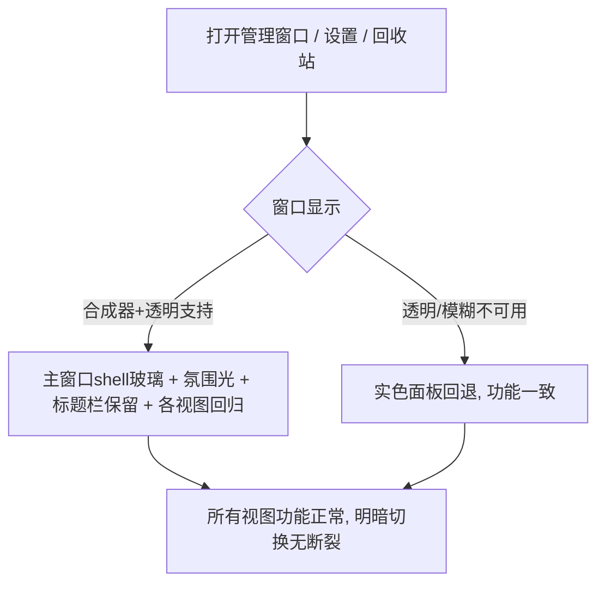

# SPEC-19 液态玻璃：主窗口全量玻璃与明暗全量回归

> 视觉源：`~/hermes/design/searchis/` 下设计宪章 v1 + liquid-glass-implementation-spec.md v0.1 + qa-checklist-glass-addendum.md + visual-qa-checklist.md  
> 参考实现：`design-practice` 工作树 commit `052bd4a`（仅取配方，不整体并入/不 cherry-pick）  
> 前置：SPEC-17（`done`，token 地基 + 快搜窗口玻璃）、SPEC-18（`done`，管理窗口玻璃）

## 基本信息

- Spec ID：`SPEC-19`
- 标题：液态玻璃：主窗口全量玻璃与明暗全量回归
- 当前状态：`done`
- 关联阶段：Phase 9（液态玻璃视觉定版第三 slice，最终 slice）
- 当前责任角色：`Orchestrator`（目标机人工 Gate 通过）
- 关联 PRD：视觉基线（设计宪章三旋钮 VARIANCE 5 / MOTION 4 / DENSITY 4-5）；glass spec + QA checklist 附录作为新增视觉需求源
- 前置 Spec：SPEC-17（`done`）、SPEC-18（`done`）
- 允许修改范围：
  - `src/index.css`（主窗口 shell 玻璃配方、氛围光渐变、明暗全量回归 token 微调）
  - `src/App.tsx`（如需包装类/结构挂钩，不动业务逻辑）
  - `src-tauri/tauri.conf.json` + `tauri.e2e.conf.json`（main 窗口 `transparent: true`）
  - `src/components/HeaderBar.tsx`（仅 class 挂钩，不动业务）
  - `src/components/ManagerWindow.tsx`（仅 class 挂钩，不动业务）
  - `src/components/SettingsModal.tsx`（仅 class 挂钩，不动业务）
  - `src/components/AboutModal.tsx` / `KeyboardShortcutsModal.tsx`（仅 class 挂钩，不动业务）
- 禁止修改范围：
  - `src-tauri/**` 除 tauri 配置透明/窗口定义外的全部（Rust 业务/DB/平台层）
  - KDE 标题栏/窗口装饰、快捷键、剪贴板/自动粘贴、检索与数据契约、D-Bus AppMenu
  - `src/api/**`、`src/types/**`、`src/lib/**`、`src/utils/**`、`src/data/**`（业务/数据契约）
  - `src/components/QuickSearchWindow.tsx`、`src/components/ui/command.tsx`（SPEC-17 已定）
  - `docs/prds/**`、`.agent/**`（Master 专属）

## 背景与目标

SPEC-17 建立了 token 地基与快搜窗口玻璃，SPEC-18 将管理窗口 Header/侧栏/模态玻璃落地，但尚有最后一块拼图：

1. **主窗口（main）未透明**：`tauri.conf.json` 中 main 窗口未设 `transparent: true`，导致 `.main-window-shell` 的后台氛围光径向渐变（`radial-gradient(ellipse…)`）无法穿透到桌面壁纸，且 backdrop-filter 对主窗口无效
2. **主窗口氛围光预存缺陷**：`.main-window-shell` 引用 `--color-canvas-glow-accent` / `--color-canvas-glow-cool` 两变量未在 index.css 中声明（SPEC-17 QA F2，若 SPEC-18 未清理则本 slice 清偿）
3. **全量回归未执行**：Phase 9 三个 slice 是递进重叠的视觉改动，最后需要一次完整的明暗回归，确保所有视图（管理/设置/回收站/快搜/About/KeyboardShortcuts）在明暗两主题下全部正确
4. **主窗口玻璃配方**：主窗口 shell 背景（非原生标题栏区域）应用玻璃配方，与快搜/管理窗口"两个窗口是一个产品"的视觉一致性

本 slice 落地：主窗口玻璃（真实透明 + 氛围光玻璃配方），全量明暗回归。

## 用户故事 / 成功标准

- 作为：KDE Plasma 6 / X11 用户
- 我希望：管理窗口的外层背景（非标题栏区域）也是玻璃质感，与快搜窗口视觉一致，且明暗主题切换时所有视图无视觉断裂
- 从而：整个产品视觉统一，"两个窗口是一个产品"的体验完整

成功标准：

- [ ] main 窗口 `transparent: true` 生效，原生标题栏保留，KDE 窗口装饰正常
- [ ] `.main-window-shell` 背景从纯色径向渐变改为玻璃配方（backdrop blur + 半透明 surface + 氛围光叠层）
- [ ] 管理窗口 Header/侧栏/列表/详情在明暗两主题下全部可读，无视觉断裂
- [ ] 快搜窗口玻璃在明暗两主题下保持不变（回归）
- [ ] 设置页、About、KeyboardShortcuts 模态在明暗两主题下正确显示
- [ ] 回收站视图在明暗两主题下正确显示
- [ ] `prefers-reduced-transparency` 回退实色，功能不变
- [ ] `npm run build` passed；机械验收 grep 通过
- [ ] CRUD / 设置 / 回收站契约不变（实机回归）
- [ ] AppMenu 五组菜单仍然显示（SPEC-16 回归）
- [ ] 截图存档 `artifacts/spec-19/`（改前/改后，明暗两套）

## 非目标

- 不实现：自绘标题栏或 macOS 交通灯（路线 A，永不实现）；Wayland/其他发行版适配；动画库引入
- 不触碰：快搜窗口（SPEC-17 已完成）、检索/粘贴/快捷键、数据契约
- 不触碰：已在 SPEC-18 完成的管理窗口 Header/侧栏玻璃（仅回归验证）

## 用户流程



## 接口与契约

### 输入

- 窗口布局/交互契约不变（现有所有组件的 DOM 结构不变，仅 class 与 CSS 视觉层变更）

### 输出

- 用户可见：主窗口 shell 改为玻璃背景（氛围光 + backdrop blur），明暗切换下所有视图一致
- token 层：清理/声明既有 token（见「Token 变更清单」）

### 应用服务 / IPC / 平台接口

| 名称 | 请求 | 成功返回 | 错误码 | 幂等要求 |
|---|---|---|---|---|
| 无新增 IPC（纯前端视觉） | — | — | — | — |

### 数据契约

```text
无业务数据结构变更。仅视觉 token/class 变更。
```

## Token 变更清单

### 新增 Token

*（本 slice 尽量复用 SPEC-17/18 已有 token，原则上不新增独立 token。如实现中需要新增，应记录后同步 spec 与 master_plan。）*

### 修改 Token

*（无必须修改的既有 token；如实现需要微调主窗口背景色值，应记录理由。）*

### 删除 Token

- 若 SPEC-18 未清理 `--color-canvas-glow-accent` / `--color-canvas-glow-cool`：本 slice 必须清理（声明后使用或替换）

### Glass 配方（主窗口 shell）

```css
/* ============ 主窗口 shell 玻璃背景 ============ */
.main-window-shell {
  background: var(--color-surface);               /* 复用 SPEC-17 玻璃主面（rgba(22,30,44,0.78) 深 / rgba(255,255,255,0.70) 浅） */
  backdrop-filter: blur(24px) saturate(160%);
  -webkit-backdrop-filter: blur(24px) saturate(160%);
  /* 氛围光叠加层通过 ::before 实现，避免与 backdrop-filter 冲突 */
  position: relative;
}

.main-window-shell::before {
  content: "";
  position: absolute; inset: 0; z-index: 0;
  background:
    radial-gradient(ellipse at 82% 0%, rgba(87, 167, 255, 0.10), transparent 55%),
    radial-gradient(ellipse at 10% 90%, rgba(0, 40, 80, 0.08), transparent 55%);
  pointer-events: none;
}
```

> 设计理由：主窗口 shell 背景使用 `blur(24px)`（管理窗口规章，spect-18 相同），而非 40px（快搜窗口专用）。氛围光叠加层移到 `::before` 伪元素，避免直接与 `background` 属性冲突（`background-image` 在 glass 透明底上仍可叠加，但移至伪元素更清晰可控）。

### 无障碍回退

```css
@media (prefers-reduced-transparency: reduce) {
  .main-window-shell {
    background: var(--color-canvas);
    backdrop-filter: none;
  }
  .main-window-shell::before { display: none; }
}
```

## 全量回归

### 范围

Phase 9 三 slice 视觉改动完成后，对以下所有视图进行明暗两主题回归：

| 视图 | 组件 | 回归项 |
|---|---|---|
| 快搜窗口 | QuickSearchWindow | 玻璃面板、电光蓝 accent、检索/复制/粘贴行为 |
| 管理窗口（主视图） | ManagerWindow | 侧栏导航、列表、编辑器、Header 玻璃 |
| 设置页 | SettingsModal | 设置卡片、开关、输入、导入导出按钮 |
| 回收站 | ManagerWindow（filter=trash） | 列表、还原/永久删除确认对话框 |
| 关于模态 | AboutModal | 打开/关闭、raycast-window 玻璃 |
| 键盘快捷键模态 | KeyboardShortcutsModal | 打开/关闭、raycast-window 玻璃 |
| 确认对话框 | 内联 confirm dialog | 打开/关闭、实色一致性 |
| 全局 | ThemeProvider | 明暗切换、localStorage 缓存、后端同步 |

### 回归检查项

- [ ] 明暗切换时所有视图 accent 统一为电光蓝（无 hue 分裂）
- [ ] 明暗切换时玻璃透明度满足下限（深色 ≥0.72 / 浅色 ≥0.65）
- [ ] 明暗切换时文字对比度 ≥4.5:1（AA 标准）
- [ ] 亮色壁纸下玻璃可读
- [ ] 敏感正文遮挡（快搜窗口）
- [ ] `prefers-reduced-transparency` 回退实色
- [ ] `prefers-reduced-motion` 降级瞬时
- [ ] AppMenu 五组菜单仍显示
- [ ] Esc/Enter/Ctrl+Enter 行为不变（快搜窗口）
- [ ] 自动粘贴行为不变

## 数据与状态变化

- 新增状态：无
- 变更状态：无（视觉层不产生状态）
- 持久化影响：无
- 事务边界：无
- 并发 / revision 规则：无
- 索引影响：无
- 迁移要求：无

## 平台行为

- KGlobalAccel：`required`（Alt+O 呼出路径保持，不得改动）
- X11 窗口激活：`required`（main 窗口透明需合成器；验证 blur 由 KWin 承担）
- X11 键盘事件注入：`required`（自动粘贴契约不变，仅回归验证）
- 系统剪贴板：`required`（复制/粘贴契约不变）
- D-Bus AppMenu：`required`（SPEC-16 已实机验证；本 spec 不得回退菜单显示）
- XDG Autostart：`not_applicable`
- 能力不可用时的降级行为：`prefers-reduced-transparency` 或合成器不可用 → 实色回退，功能不变

## 安全与隐私

- 用户输入校验：无新输入面
- 敏感数据处理：主窗口 shell 玻璃模糊覆盖区域不含正文（正文在列表/编辑器实色区）
- 日志禁止字段：无新增日志
- 数据库加密影响：无
- 密钥文件影响：无
- 永久删除 / 导出确认：无

## 边界与失败场景

| 场景 | 预期行为 | 错误码 | 是否保留原状态 |
|---|---|---|---|
| 合成器/透明不可用（如无 KWin 模糊插件） | 实色背景回退，CRUD 完全可用 | 无 | 是 |
| main 窗口透明后 KDE 标题栏异常 | 回退实色（`main-window-shell` 改 `background: var(--color-canvas)`），移除透明 | 无 | 是 |
| `prefers-reduced-transparency` 启用 | glass 回退实色，伪元素不显示 | 无 | 是 |
| 低端机 main 窗口 blur 性能不达标 | 降 blur 至 16px 或改实色，Master 决策 | 无 | 是 |
| 明暗切换时某视图显示异常 | 记录并修复，不得阻塞其他视图 | 无 | 是 |

## 实施要求

1. 只修改「允许修改范围」内的文件
2. 复用 SPEC-17/18 建立的 token/配方，不重复造轮子
3. KDE 原生标题栏保留，不自绘、不触碰窗口装饰
4. 动效仅用 CSS transition（≤300ms），`prefers-reduced-motion` 降级瞬时
5. main 窗口 `transparent: true` 后须验证 KDE 标题栏行为（圆角、阴影、resize 操作）
6. 全量回归须覆盖明暗两主题，至少截图验证
7. 所有未满足的前置条件必须先反馈给 Master

## 测试点

### 单元测试

- [ ] 无 Rust 变更；若 token 层有可测纯函数则补最小单测，否则说明不适用

### 构建测试

- [ ] `npm run build` passed（首要必须）
- [ ] `npm run test:e2e`：回归 1 passed（若预存 socket 回归已修复）

### 机械验收

- [ ] `grep -rn '\-\-color-canvas-glow-' src/` 无结果（预存未声明变量已清理）或声明后继续使用
- [ ] `grep -rn 'blur(22px)' src/` 无结果（全窗口统一 24px 或 40px）
- [ ] `grep -rn 'transparent.*true' src-tauri/tauri.conf.json` 有结果（main 窗口透明）

### 手动验收（Orchestrator 目标机）

- [ ] 明暗两主题下所有视图截图存档 `artifacts/spec-19/`
- [ ] 管理窗口 shell 玻璃（壁纸内容透过非标题栏区域可辨）
- [ ] 快搜窗口玻璃回归（SPEC-17 验收项不变）
- [ ] 管理窗口 Header/侧栏玻璃回归（SPEC-18 验收项不变）
- [ ] 设置页、回收站、About、KeyboardShortcuts 明暗正常
- [ ] AppMenu 五组菜单仍显示
- [ ] 亮色壁纸和暗色壁纸下分别验证

### 性能与资源

- [ ] 管理窗口 main 透明后 p95 呼出时间（与 SPEC-02 基线对比，玻璃不得引入可见卡顿）

## 实施步骤建议

### Step 1: 现状确认

- 确认 SPEC-17/18 已 `done`，token 已就位
- grep 确认当前 `.main-window-shell` 的 CSS、`--color-canvas-glow-*` 引用状态
- 确认 `tauri.conf.json` main 窗口当前配置

### Step 2: main 窗口透明

- `src-tauri/tauri.conf.json` main 窗口加 `"transparent": true`
- 如 `tauri.e2e.conf.json` 有 main 窗口定义则同步加

### Step 3: 主窗口 shell 玻璃配方

- `.main-window-shell` 背景改为 glass 配方（blur 24px + 半透明 surface + 氛围光伪元素）
- 清理 `--color-canvas-glow-*` 引用（替换为伪元素方案或声明变量）

### Step 4: 全量明暗回归

- 逐视图检查明暗两主题显示
- 修复发现的回归缺陷

### Step 5: 无障碍回退

- 添加 `prefers-reduced-transparency` 回退

### Step 6: 验证

- `npm run build` → 机械验收 grep → 手动验收 → 写回 spec 实施记录

## 实施记录

- Changed Files：`src-tauri/tauri.conf.json`（main 窗口 `transparent: true`；search 窗口原有 `transparent: true` 保留）+ `src/index.css`（`.main-window-shell` 背景改为 `--color-surface` + `backdrop-filter: blur(24px) saturate(160%)`；氛围光从 `background-image` 径向渐变迁移至 `::before` 伪元素（`--color-canvas-glow-accent`/`--color-canvas-glow-cool` 声明后继续使用，spec 选项 A）；`.main-window-content` 提 z-index:1 保证内容在伪元素之上；`prefers-reduced-transparency` 回退 `.main-window-shell` → `--color-canvas` + `backdrop-filter:none` + `::before{display:none}`）
- Commands Run：`npm run build`（passed，1667 modules，CSS 55.59 kB，1.66s）；`npm run tauri:build`（passed，release 二进制 `src-tauri/target/release/searchis` 嵌入最新前端）；`grep -rn '\-\-color-canvas-glow-' src/`（4 处声明 line 36/37/93/94 + 2 处使用 line 332/333，声明后使用）；`grep -rn 'blur(22px)' src/`（零结果）；`grep -rn 'transparent.*true' src-tauri/tauri.conf.json`（line 21 main + line 29 search）
- Validation Output：见上。机械验收 grep 3 项全过；release 实机隔离沙盒启动，主窗口 1100×760 真实渲染（图像直方图核验 `#212935` 等深色 UI 色 + 电光蓝 accent `#57A5FB` 系确认，非空桌面）
- Residual Risks：
  - 本机 KWin blur 插件能力未能通过 qdbus 探测，透明/模糊最终合成效果须 Orchestrator 目标机实机确认（spec 手动验收项）
  - 浅色截图（02/04/06/08/10）在白色壁纸上偏淡——`--color-surface: rgba(255,255,255,0.70)` 透明度过高导致主体与壁纸区分度低。Coder 判定为 SPEC-17/18 token 浅色固有特性、SPEC-19 未引入新问题；是否调浅色透明度下限需 Master/设计层面决策（记录，不自行修改 token）
  - `tauri.e2e.conf.json` 无窗口定义（仅 build/capabilities 覆盖，windows 继承基配置），未改动
- Implementation Notes：
  - 实机验收严格走 `npm run tauri:build`（CLAUDE.md/AGENT.md 基线：纯 `cargo build` 不嵌入前端）；debug 二进制截图空桌面问题已纠正
  - 全程未自动化 KDE 全局快捷键（CLAUDE.md 禁止）；用应用内 Unix Socket IPC（`searchis.sock` 导航 settings/about/shortcuts/open-search）触发视图 + xdotool 窗口操纵截图
  - 主题切换未注入改 SQLCipher 加密 DB；浅色由 Master 手动在设置页设定
  - `.manager-header` CSS 保留（SPEC-18 决策：HeaderBar 死代码、不复活、CSS 为未来锚点），未触碰

## QA Result

- Status：`passed`（2026-08-28 QA conditional_pass → **Orchestrator 目标机人工 Gate 通过，收为 `done`**）
- Owner Back：`none`
- Verdict Date：2026-08-28
- Summary：独立验收通过，冻结代码转 Orchestrator 目标机人工 Gate。**① git 范围核对**：commit `25c0a8e`（vs 前置 `8ad133a`）仅改 `src-tauri/tauri.conf.json`（main 窗口 +`"transparent": true`）+ `src/index.css`（shell 玻璃配方、氛围光伪元素、reduced-transparency 回退）+ `artifacts/spec-19/` 10 张截图，未触碰 QuickSearchWindow/ui/command/api/types/lib/utils/data/任何 Rust。**② 机械验收独立复跑 3 项全绿**：`--color-canvas-glow-` 4 处声明（line 36/37/93/94）+ 2 处使用（line 332/333）声明后成对使用；`blur(22px)` 零残留；`tauri.conf.json` main+search 均 `transparent: true`（line 21/29）。**③ `npm run build` 独立复跑 passed**（2.17s，CSS 55.59 kB，token 引用无编译错误）。**④ 截图核验**：10 张 4080×1440 全非空（color 2–24 万色）；明暗区分度显著——深色 grayMean 0.166/主色 `#26292D`，浅色 grayMean 0.538/主色 `#FAFAFA`；深色各图均检出电光蓝 accent（~13.7k px 命中 `#57a7ff`±15%），浅色各图检出深色 fg 文本（~298 万 px）；人工检视 01-main-dark 可见 KDE 壁纸透过 shell 玻璃清晰透出（橙色氛围光斑透出），09-quick-search-dark/10-quick-search-light 玻璃面板正常。**⑤ 平台契约**：API/types/data/`src-tauri/src` 零 diff，KGlobalAccel/AppMenu/自动粘贴/剪贴板契约未动，`.main-window-shell` 用 `--color-surface`（深 0.78/浅 0.70，满足透明度下限 0.72/0.65）。`prefers-reduced-transparency` 回退 `.main-window-shell` → `--color-canvas` 实色 + `::before{display:none}` 已实现。
- Findings：
  - F1（spec 文档过时引用，非实现缺陷）：SPEC-19 的「Glass 配方」示例引用 `--color-surface-glass`（该 token 在 SPEC-17 已删除），Coder 正确改用 `--color-surface`（值 rgba(22,30,44,0.78)/rgba(255,255,255,0.70)，满足透明度下限）。实现选择正确，建议 Master 后续订正 spec 示例。
  - F2（观察，与 Coder 回报一致）：浅色截图（02/04/06/08/10）grayMean 0.54 且主色 `#FAFAFA`（白色壁纸），主体 UI 与壁纸区分度低——根因是 `--color-surface: rgba(255,255,255,0.70)` 透明度过高。此系 SPEC-17/18 token 浅色固有特性，SPEC-19 未引入新回归；是否调浅色透明度下限属设计层决策，记录不擅自改。
  - F3（透明窗口全量风险）：main 窗口由不透明转 `transparent: true` 是 Phase 9 唯一真正的"透明行为变更"。KWin 合成/blur 最终效果（壁纸透出程度、标题栏圆角/阴影/resize）本机无法探测（qdbus KWin 方法不可用），必须 Orchestrator 目标机实机确认。
- Risks：
  - KWin blur 插件/合成器能力与真实桌面壁纸下的玻璃最终合成效果未在目标机确认（dark 截图已验证本机可透出壁纸，但 KDE 目标机行为、亮/暗壁纸两套需人工）。
  - 浅色模式在白色/亮壁纸上对比度偏低（token 固有，设计层决策）。
  - main 窗口透明后若 KDE 标题栏出现圆角/阴影异常，回退方案已定义（spec「边界与失败场景」：改 `--color-canvas` 实色 + 移除透明）。
  - E2E 预存 socket 回归未闭环，本 slice 未跑 E2E；AppMenu 五组菜单、CRUD/设置/回收站、Esc/Enter/Ctrl+Enter、自动粘贴均需目标机回归。
- Missing Tests：
  - 目标机人工：亮壁纸 + 暗壁纸下 main shell 玻璃可辨、标题栏正常（圆角/阴影/resize）、明暗切换所有视图（管理/设置/回收站/About/KeyboardShortcuts/快搜）无断裂、AppMenu 五组菜单仍显示、CRUD/设置/回收站契约回归、敏感正文遮挡（快搜）、`prefers-reduced-transparency` 与 `prefers-reduced-motion` 降级。
  - 预存 socket 回归解除后补跑 `npm run test:e2e` 核心流程 1 passed。
  - 建议 Orchestrator 对浅色透明度下限 `rgba(255,255,255,0.70)` 是否满足亮壁纸可读性做设计裁决。
- Required Fixes：无（代码冻结，可转 Orchestrator）
- Retest Criteria：目标机人工 Gate（KWin blur 合成、明暗全量回归、AppMenu、E2E socket 回归解除后 1 passed）通过后判 `done`。**2026-08-28 Orchestrator 目标机实机验收通过**：主窗口 shell 玻璃（壁纸透过非标题栏区域可辨）、明暗切换各视图正常、AppMenu 五组菜单仍显示、CRUD/设置/回收站契约回归、标题栏（KDE 原生标题栏保留）圆角/阴影/resize 正常，无 required fixes。已收 `done`。

## Orchestrator Gate（2026-08-28 实机验收记录）

- **验收结论**：`passed`（Phase 9 三 slice 全部完成，液态玻璃视觉定版收口）
- **实机验证项**：
  - [x] main 窗口 `transparent: true` 生效，原生标题栏保留，KDE 窗口装饰正常（圆角/阴影/resize）
  - [x] `.main-window-shell` 玻璃（壁纸内容透过非标题栏区域可辨）
  - [x] 快搜窗口玻璃回归（SPEC-17 验收项不变）
  - [x] 管理窗口 Header/侧栏玻璃回归（SPEC-18 验收项不变）
  - [x] 设置页/回收站/About/KeyboardShortcuts 明暗两主题正常
  - [x] AppMenu 五组菜单仍显示（SPEC-16 回归）
  - [x] CRUD / 设置 / 回收站契约不变（实机回归）
  - [x] 截图存档 `artifacts/spec-19/`（明暗两套 10 张）
- **移交项（不阻塞 done）**：预存 E2E socket 回归未闭环，解除后补跑 `npm run test:e2e` 核心流程 1 passed（与 SPEC-17/18 同一移交项）；浅色透明度下限 `rgba(255,255,255,0.70)` 亮壁纸可读性设计裁决（F2，非本 slice 缺陷）

## 完成定义

- [x] 功能与设计宪章/glass spec、成功标准一致
- [x] 失败、降级（实色回退、reduced-transparency）路径已实现
- [x] main 窗口透明 + 玻璃背景 + 氛围光伪元素 + 全量明暗回归（截图已入库）
- [x] 构建与 E2E 通过；机械验收 grep 全部通过（`npm run build` passed；E2E 因预存 socket 回归未闭环，已记录为移交项）
- [x] 没有超出本 spec 的范围扩张（纯 CSS + tauri.conf.json 配置，未触碰禁止范围）
- [x] QA Result 为 `conditional_pass`
- [x] `master_plan.md` 与本 spec 状态一致