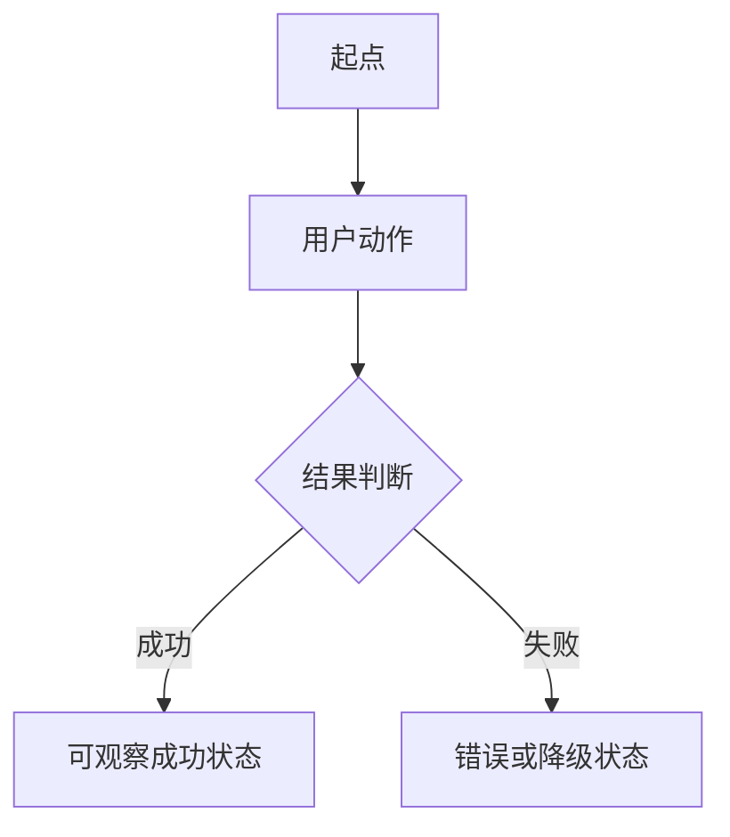

# Searchis Vertical Slice Spec Template

> 使用说明：复制本文件为 `NN-feature-name.md` 后填写。禁止直接把本模板标记为活跃 spec。

## 基本信息

- Spec ID：`SPEC-NN`
- 标题：
- 当前状态：`todo | in_progress | in_qa | qa_failed | done`
- 关联阶段：
- 当前责任角色：`Master | Coder | QA`
- 关联 PRD：`FR-...`、`AC-...`、`NFR-...`
- 前置 Spec：无
- 允许修改范围：
- 禁止修改范围：

## 背景与目标

描述一个用户可观察的端到端闭环，以及它解决的具体问题。

## 用户故事 / 成功标准

- 作为：
- 我希望：
- 从而：

成功标准：

- [ ] 给定明确前置状态，用户执行动作后得到可观察结果。
- [ ] 至少覆盖一条失败或降级路径。
- [ ] 结果满足关联 PRD 的量化指标。

## 非目标

- 本 spec 不实现：
- 后续 spec 承担：

## 用户流程



## 接口与契约

### 输入

- 

### 输出

- 

### 应用服务 / IPC / 平台接口

| 名称 | 请求 | 成功返回 | 错误码 | 幂等要求 |
|---|---|---|---|---|
|  |  |  |  |  |

### 数据契约

```text
待填写：字段、类型、约束、默认值和版本。
```

## 数据与状态变化

- 新增状态：
- 变更状态：
- 持久化影响：
- 事务边界：
- 并发 / revision 规则：
- 索引影响：
- 迁移要求：

## 平台行为

- KGlobalAccel：`not_applicable | required`
- X11 窗口激活：`not_applicable | required`
- X11 键盘事件注入：`not_applicable | required`
- 系统剪贴板：`not_applicable | required`
- D-Bus AppMenu：`not_applicable | required`
- XDG Autostart：`not_applicable | required`
- 能力不可用时的降级行为：

## 安全与隐私

- 用户输入校验：
- 敏感数据处理：
- 日志禁止字段：
- 数据库加密影响：
- 密钥文件影响：
- 永久删除 / 导出确认：

## 边界与失败场景

| 场景 | 预期行为 | 错误码 | 是否保留原状态 |
|---|---|---|---|
|  |  |  |  |

## 实施要求

1. 只修改“允许修改范围”内的文件。
2. 复用现有业务命令，不创建第二套状态或事务逻辑。
3. 不增加云服务、音效、Markdown 渲染或非 Arch/KDE/X11 兼容层。
4. 所有未满足的前置条件必须先反馈给 Master。

## 测试点

### 单元测试

- [ ] 

### 集成测试

- [ ] 

### 手动验收

- [ ] 在目标 Arch Linux、KDE Plasma 6、X11 环境执行关联 AC。

### 性能与资源

- [ ] 本 spec 涉及性能指标时，记录设备、内核、Plasma 版本、样本数和 p95/p99。

## 实施记录

- Changed Files：
- Commands Run：
- Validation Output：
- Residual Risks：
- Implementation Notes：

## QA Result

- Status：`not_run | passed | failed`
- Owner Back：`Master | Coder | none`
- Verdict Date：
- Summary：
- Findings：
- Risks：
- Missing Tests：
- Required Fixes：
- Retest Criteria：

## 完成定义

- [ ] 功能与关联 PRD、成功标准一致。
- [ ] 失败、降级和事务路径已实现。
- [ ] 测试已补齐并记录实际结果，或已说明无法执行的原因。
- [ ] 没有超出本 spec 的范围扩张。
- [ ] QA Result 为 `passed`。
- [ ] `master_plan.md` 与本 spec 状态一致。
