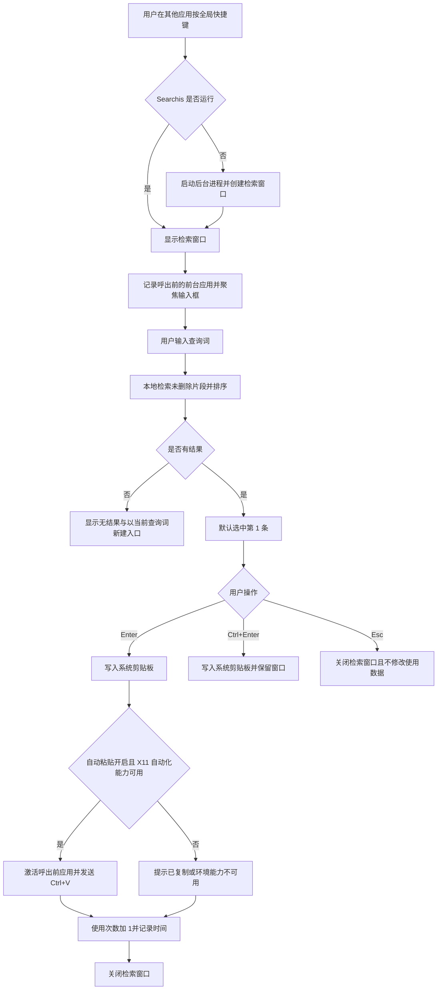
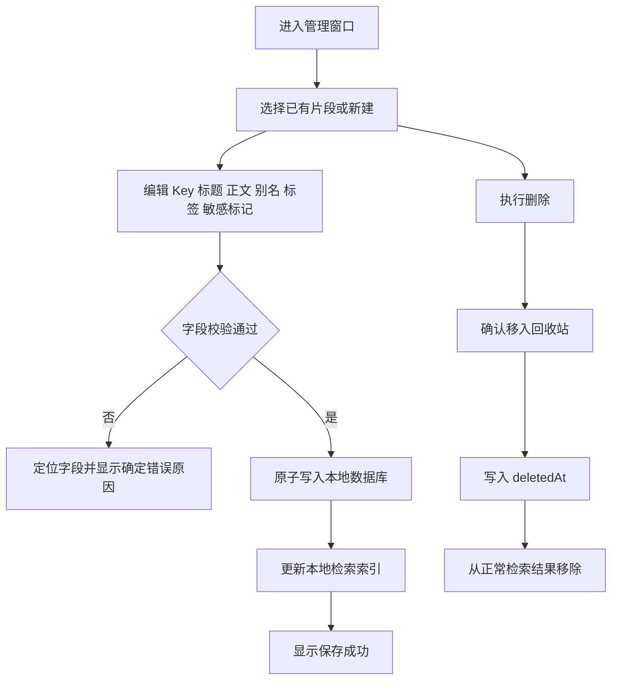
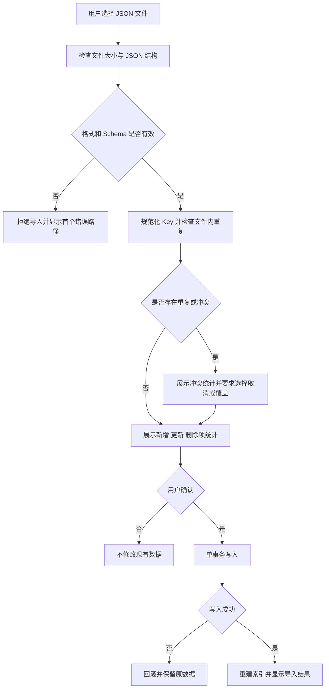
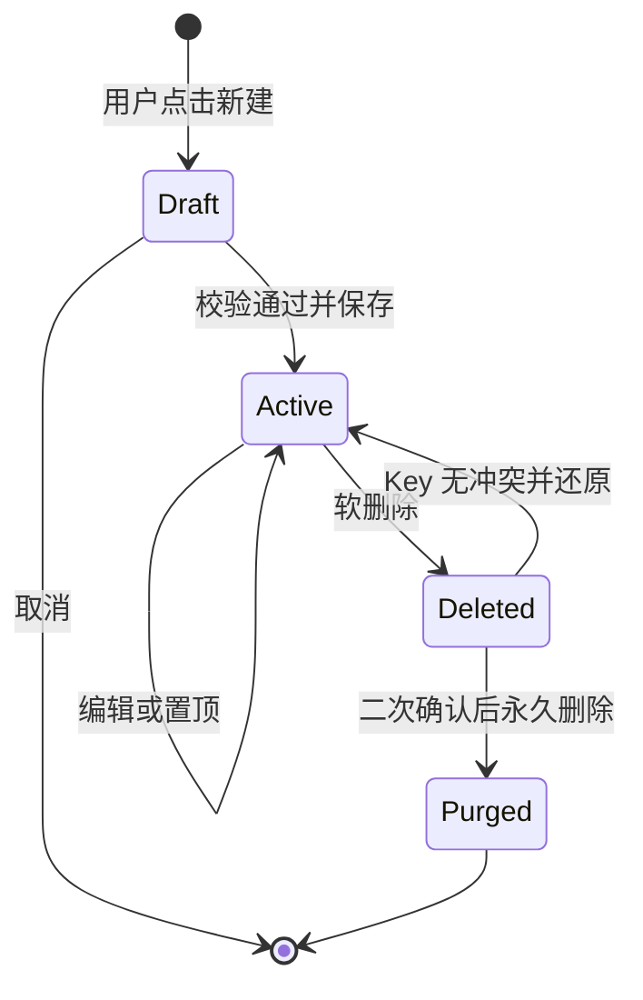
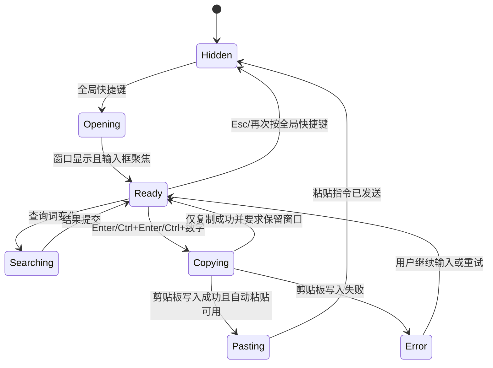

# Searchis V1 产品需求文档（PRD）

> 文档版本：v0.3  
> 产品版本：V1 / MVP  
> 状态：待评审  
> 更新日期：2026-08-01  
> 依据：`docs/inital-workflow/character/PM.md`、`front-baseline/` 交互设计基线

## 1. 文档目的

本文档定义 Searchis V1 的产品边界、业务规则、数据模型、状态机、验收标准与交付任务。研发、测试与 AI Agent 应以本文档作为 V1 行为基线；`front-baseline/` 负责提供界面布局与交互参考。当二者冲突时，以本文档中带编号的需求和验收标准为准，并在开发前提交差异记录。

## 2. 已确认产品约束

以下条目均为 V1 已确认边界。变更任一条目必须更新文档版本、受影响需求编号和验收标准。

| 编号 | 结论 | 影响 | 状态 |
|---|---|---|---|
| A-01 | V1 仅适配本机 Arch Linux、KDE Plasma 6 与 X11 会话 | 全局快捷键、窗口激活、自动粘贴、开机启动和打包均采用 Linux/KDE/X11 能力 | 已确认 |
| A-02 | 产品为单机、单用户、本地应用；不建设账户、服务端、云同步或跨设备同步 | 数据与设置只保存在用户本机 | 已确认 |
| A-03 | V1 片段正文仅支持纯文本 UTF-8；Markdown 语法支持列入后续版本候选范围 | V1 不解析或渲染 Markdown，不支持富文本、图片和文件 | 已确认 |
| A-04 | 全局呼出快捷键默认使用 `Alt + O`，并允许用户修改 | 新组合键注册失败时不得覆盖当前有效快捷键 | 已确认 |
| A-05 | V1 支持最多 10,000 条未删除片段，单条正文最大 100 KB | 作为 V1 容量和性能验收基线 | 已确认 |
| A-06 | 回收站支持手动清空和可配置的自动清理；自动清理默认关闭 | 自动清理周期仅允许关闭、7 天、30 天或 90 天 | 已确认 |
| A-07 | 不采集系统剪贴板历史；仅管理用户主动创建或导入的内容 | 降低隐私范围 | 已确认 |
| A-08 | 支持 KDE Plasma 全局菜单（Global Menu 小部件），采用 FR-KDE-01 定义的五组菜单 | 应用菜单需通过 KDE 可识别的 D-Bus AppMenu 协议导出 | 已确认 |
| A-09 | 不提供任何操作音效、音效设置或音频资源 | `front-baseline/` 中现有音效控件和配置必须删除 | 已确认 |
| A-10 | V1 只交付可执行文件，不提供 PKGBUILD、安装包或应用内自动更新 | 发布说明只包含运行依赖、校验值和启动方式 | 已确认 |
| A-11 | 本地数据只使用项目选定数据库自身的加密能力，不依赖 KWallet 或 Secret Service | 加密密钥由应用本地管理 | 已确认 |
| A-12 | JSON 备份使用明文格式，不增加密码或备份文件加密 | 含敏感片段时仍执行导出前二次确认 | 已确认 |
| A-13 | 保留 `front-baseline/` 中定义的 6 步首次使用向导 | 向导按 Arch Linux/KDE/X11 能力重新实现 | 已确认 |

研发不得把 Arch Linux、KDE Plasma 6、X11 之外的平台兼容，或任何云端能力，纳入 V1 实现。

## 3. 产品定义

### 3.1 一句话定义

Searchis 是一款运行于本机 Arch Linux、KDE Plasma 6、X11 会话的文本片段管理工具。用户通过全局快捷键呼出检索窗口，输入片段 Key，选中结果后将预先保存的纯文本写入剪贴板，并按配置决定是否向呼出前的应用发送粘贴指令。

### 3.2 用户问题

用户在多个应用中反复输入地址、回复模板、代码段、命令、联系方式等固定文本。目前需要依赖手动输入、文件查找或剪贴板历史，存在以下成本：

1. 同一文本被重复输入，且容易产生拼写差异。
2. 剪贴板历史以时间排序，用户无法依靠稳定 Key 定位内容。
3. 敏感文本在列表中直接展示时存在旁观泄露风险。
4. 跨应用粘贴需要切换窗口并执行多次操作。

### 3.3 产品目标

| 目标编号 | 目标 | V1 验证口径 |
|---|---|---|
| G-01 | 用户能用稳定 Key 定位片段 | 在 10,000 条片段数据下，输入完整 Key 后目标片段排名第 1 |
| G-02 | 降低一次粘贴的操作数 | 已授权且自动粘贴开启时，从呼出到完成粘贴不超过：1 次快捷键、Key 输入、1 次 Enter |
| G-03 | 保证数据只由用户本机持有 | 产品不建设服务端；不上传片段、搜索词、剪贴板内容、设置、日志或备份文件 |
| G-04 | 提供可恢复的数据管理能力 | 普通删除可从回收站还原；用户可导入、导出完整备份 |
| G-05 | 键盘完成核心路径 | 呼出、检索、选择、复制、粘贴、关闭均无需鼠标 |

### 3.4 非目标

以下内容不属于 V1：

- 系统剪贴板历史采集。
- 用户账户、云同步、跨设备同步、团队共享与远程权限管理；以上能力不进入当前或后续已规划范围。
- Arch Linux + KDE Plasma 6 + X11 之外的 Linux 发行版、桌面环境、显示协议及其他操作系统。
- 图片、文件、富文本、HTML 格式粘贴。
- V1 不解析或渲染 Markdown；Markdown 语法支持仅作为后续版本候选项。
- 操作音效、音效设置和音频资源。
- PKGBUILD、安装包、应用内自动更新。
- 动态变量、日期函数、表单填充和脚本执行。
- 浏览器扩展、开放 API、插件市场。
- 端到端同步冲突解决。
- 使用内容、搜索词或剪贴板正文的遥测分析。

## 4. 用户与使用场景

### 4.1 目标用户

| 用户角色 | 特征 | 核心任务 |
|---|---|---|
| 高频文本输入者 | 每日跨应用重复输入固定文本 | 用 Key 调出并粘贴片段 |
| 开发者 | 保存命令、代码片段、路径和接口示例 | 按 Key、别名或标签检索 |
| 客服与运营人员 | 使用标准回复、地址和说明文字 | 管理模板并避免内容不一致 |
| 隐私敏感用户 | 保存个人信息或内部文本 | 默认遮挡敏感片段并控制导出 |

### 4.2 核心 User Stories

- **US-01**：As a 高频文本输入者, I want 通过全局快捷键呼出 Searchis 并输入 Key, so that 我可以在当前应用中粘贴预先保存的文本。
- **US-02**：As a 用户, I want 创建、编辑、分类和删除文本片段, so that 我的片段库与实际使用内容一致。
- **US-03**：As a 用户, I want 使用别名、标题和标签找到片段, so that 忘记完整 Key 时仍能定位内容。
- **US-04**：As a 键盘用户, I want 使用方向键、Enter 和组合键完成选择, so that 核心路径不依赖鼠标。
- **US-05**：As a 隐私敏感用户, I want 将片段标记为敏感并默认遮挡, so that 屏幕预览不会直接展示正文。
- **US-06**：As a 用户, I want 导出和导入本地备份, so that 更换设备或应用数据损坏后可以恢复片段。
- **US-07**：As a 首次用户, I want 完成快捷键、运行环境与首条片段引导, so that 我能确认应用具备检索和粘贴条件。

## 5. 术语与领域边界

| 术语 | 定义 |
|---|---|
| Snippet / 片段 | 用户主动保存的一条纯文本记录 |
| Key | 片段在当前片段库内唯一、不区分大小写的检索标识 |
| Alias / 别名 | Key 之外的辅助检索词，不要求全局唯一 |
| Tag / 标签 | 用于管理视图筛选的分类字符串 |
| 检索窗口 | 通过全局快捷键呼出的置顶窗口 |
| 管理窗口 | 用于新增、编辑、筛选、删除和恢复片段的主窗口 |
| 自动粘贴 | 写入系统剪贴板后，向呼出前的前台应用发送一次 `Ctrl + V` |
| 仅复制 | 只写入系统剪贴板，不发送粘贴按键 |
| KDE 全局菜单 | 由 Plasma Global Menu 小部件展示的应用菜单，通过 D-Bus AppMenu 协议导出；不是全局快捷键或系统托盘菜单 |
| 敏感片段 | 在列表和预览中默认不展示正文的片段 |
| 回收站 | 保存已软删除片段的视图；其中片段不参与正常检索 |

领域边界：Searchis 只管理应用内片段和完成用户发起的剪贴板写入，不读取、记录或索引用户在其他应用中产生的剪贴板历史。

## 6. 业务流程

### 6.1 核心检索与粘贴流程



### 6.2 片段管理流程



### 6.3 导入流程



## 7. 功能需求

### 7.1 首次使用与运行环境

#### FR-ONB-01 首次使用向导

首次启动且本地不存在 `onboardingCompletedAt` 时，应用必须展示 6 步向导：产品说明、全局快捷键、Arch Linux/KDE/X11 环境检查、创建首条片段、检索演练、完成。

#### FR-ONB-02 运行环境与能力检测

- 应用必须检测当前发行版、KDE Plasma 主版本、X11 会话、KGlobalAccel D-Bus 服务、系统剪贴板和 X11 键盘事件注入能力。
- 检测结果必须来自当前运行环境，不得使用固定“可用”文案。
- 发行版、桌面环境或显示协议不符合 A-01 时，应用必须显示检测值和 V1 支持基线；不承诺自动粘贴与全局菜单可用。
- X11 键盘事件注入不可用时，Enter 退化为“仅复制并关闭”，并显示环境能力提示。
- 剪贴板写入失败时不得增加 `usageCount`。

#### FR-ONB-03 向导完成

只有完成第 6 步或明确点击“跳过向导”后才写入完成状态。应用异常退出后，重新进入上次未完成步骤。

### 7.2 片段创建与编辑

#### FR-SNP-01 字段规则

| 字段 | 必填 | 规则 |
|---|---:|---|
| `key` | 是 | 去除首尾空白后转小写；内部连续空白转为 `-`；长度 1–64；允许 Unicode 字母、数字、`-`、`_`、`.`；不区分大小写唯一 |
| `title` | 是 | 去除首尾空白；长度 1–100 |
| `content` | 是 | 保留换行与内部空白；UTF-8 编码后 1 byte–100 KB |
| `aliases` | 否 | 每项 1–64 字符；单条最多 20 项；同一片段内不区分大小写去重 |
| `tags` | 否 | 每项 1–32 字符；单条最多 20 项；同一片段内不区分大小写去重 |
| `sensitive` | 是 | 默认 `false` |
| `pinned` | 是 | 默认 `false` |

#### FR-SNP-02 Key 唯一性

- 唯一范围包含未删除和回收站中的片段。
- `Addr-Home` 与 `addr-home` 视为同一 Key。
- 创建或编辑导致冲突时必须拒绝保存，并显示冲突 Key。
- 检查与写入必须在同一事务约束下完成，数据库必须存在规范化 Key 唯一索引。

#### FR-SNP-03 保存语义

- 新建成功后生成不可变 `id`、`createdAt` 与初始 `updatedAt`。
- 编辑不得修改 `id`、`createdAt`、`usageCount` 和 `lastUsedAt`。
- 每次成功修改正文或元数据后更新 `updatedAt`。
- 保存必须为原子操作；写入失败时界面保留未保存输入。
- 用户连续触发相同保存请求时不得创建重复记录。

#### FR-SNP-04 置顶与敏感标记

- 置顶只影响无查询时的排序加权，不覆盖精确 Key 匹配优先级。
- 敏感片段在管理列表、检索列表和预览面板中默认以固定占位符展示正文。
- 展示敏感正文必须由用户在当前窗口会话内主动点击或按键触发；窗口关闭后恢复遮挡。
- `sensitive=true` 不等同于访问控制，界面必须在帮助文档中说明这一点。

### 7.3 检索与排序

#### FR-SCH-01 可检索字段

检索范围仅包含未删除片段的 `key`、`aliases`、`title`、`tags` 和 `content`。匹配不区分英文字母大小写，查询词去除首尾空白。

#### FR-SCH-02 排序优先级

非空查询按以下优先级排序，前一层级始终高于后一层级：

1. Key 完全匹配。
2. Key 前缀匹配。
3. Key 子串匹配。
4. Alias 完全、前缀或子串匹配。
5. Title 子串匹配。
6. Tag 子串匹配。
7. Content 子串匹配。

同层级依次按 `pinned` 降序、`usageCount` 降序、`lastUsedAt` 降序、`key` 升序排序。缺失 `lastUsedAt` 视为最早时间。

空查询按 `pinned` 降序、`usageCount` 降序、`lastUsedAt` 降序、`updatedAt` 降序、`key` 升序排序。

#### FR-SCH-03 结果数量

- 默认最多展示 20 条结果。
- 用户可在设置中配置 5–100 条。
- 结果总数大于展示上限时，界面显示“展示 N / 总数 M”。

#### FR-SCH-04 无结果状态

查询无结果时显示当前查询词，并提供“以该查询词作为 Key 新建片段”操作。跳转管理窗口后必须预填规范化后的 Key，不得丢弃用户输入。

### 7.4 全局检索窗口与键盘交互

#### FR-PCK-01 呼出与关闭

- 默认快捷键为 `Alt + O`，通过 KDE KGlobalAccel 注册；用户可录制新的包含至少一个修饰键的组合键。
- 快捷键冲突或注册失败时不得覆盖原快捷键，必须显示失败原因。
- 呼出后输入框获得焦点，默认选中第 1 条结果。
- `Esc` 关闭窗口且不修改片段。
- 再次按全局快捷键切换窗口显示状态。

#### FR-PCK-02 导航与操作

| 按键 | 行为 |
|---|---|
| `↑` / `↓` 或 `J` / `K` | 上下移动一项，不越过列表边界；输入法组合态下不拦截 J/K |
| `Enter` | 执行配置对应的复制/自动粘贴，并在成功后关闭窗口 |
| `Ctrl + Enter` | 仅复制，成功后保留窗口 |
| `Ctrl + 1` 至 `Ctrl + 9` | 执行对应序号结果的粘贴动作 |
| `Ctrl + E` | 在管理窗口打开当前片段 |
| `Ctrl + N` | 以当前查询词预填 Key 新建片段 |
| `Tab` | 展开或收起预览面板 |
| `Esc` | 关闭窗口 |

无结果时，选择、复制、粘贴、编辑快捷键不执行写入操作。

#### FR-PCK-03 粘贴事务

一次粘贴操作按以下顺序执行：

1. 保存呼出前的前台应用标识。
2. 将片段正文写入系统剪贴板。
3. 写入成功后，根据 `autoPaste` 和 X11 键盘事件注入能力决定是否发送粘贴指令。
4. 自动粘贴时通过 KDE/X11 窗口能力激活步骤 1 的应用，再发送一次 `Ctrl + V`。
5. 复制成功后，以单次原子更新将 `usageCount + 1` 并写入 `lastUsedAt`。
6. 关闭窗口或按“仅复制”规则保留窗口。

同一用户动作必须拥有 `operationId`；系统事件重复投递时，同一 `operationId` 只允许增加一次使用次数。

#### FR-PCK-04 剪贴板恢复

`restoreClipboard` 在 V1 中不启用，设置界面不得展示可操作开关。保留配置字段仅用于后续版本迁移，不实现自动恢复，避免覆盖用户在粘贴后主动复制的新内容。

### 7.5 管理窗口

#### FR-MGT-01 列表与筛选

管理窗口必须提供：全部片段、置顶、最近使用、标签、回收站五类视图。普通视图不展示 `deletedAt` 非空的片段。

“最近使用”定义为 `lastUsedAt` 非空，并按 `lastUsedAt` 降序排列。

#### FR-MGT-02 管理检索

管理窗口检索覆盖 Key、标题、正文、别名和标签，采用不区分英文字母大小写的子串匹配。敏感片段可以被正文命中，但结果列表不得展示命中的正文片段。

#### FR-MGT-03 排序

支持最近修改、使用次数、Key 字典序、标题字典序四种排序。排序结果相同时使用 `key` 升序作为稳定次序。

#### FR-MGT-04 删除与恢复

- 删除操作写入 `deletedAt`，不物理删除数据。
- 回收站内支持还原与单条永久删除。
- 永久删除前必须展示二次确认，文案包含片段 Key 和“不可恢复”。
- 用户取消确认时不得修改数据。
- 还原时如 Key 与现有记录冲突，必须拒绝还原并提示先修改冲突 Key 或永久删除其中一条。

#### FR-MGT-05 回收站清理

- 回收站必须提供“清空回收站”操作，一次永久删除全部 `deletedAt` 非空的片段。
- 手动清空前必须展示二次确认，文案包含待删除数量和“不可恢复”；取消后不得修改数据。
- 自动清理默认关闭。用户可选择关闭、7 天、30 天或 90 天。
- 自动清理在应用启动后执行一次；应用连续运行时，每 24 小时检查一次。
- 当 `currentTime - deletedAt` 大于或等于配置天数时，片段进入本次清理集合。
- 一次清理必须在单一事务中完成；任一删除失败时全部回滚。
- 自动清理结束后显示删除数量；数量为 0 时不显示通知。

### 7.6 设置

#### FR-SET-01 设置项

V1 提供以下设置：全局快捷键、开机启动、自动粘贴、主题、最大结果数、回收站自动清理周期。主题支持浅色、深色、跟随系统。产品不得提供音效设置。

每项设置修改成功后立即持久化；系统 API 调用失败时恢复旧值并显示错误。

#### FR-SET-02 开机启动

开机启动使用 XDG Autostart `.desktop` 条目。状态必须读取实际文件及其启用状态；切换失败时恢复旧值并显示错误。

### 7.7 KDE Plasma 全局菜单

#### FR-KDE-01 菜单导出

- 应用必须通过 KDE Plasma 6 可识别的 D-Bus AppMenu 协议导出应用菜单，使 Plasma Global Menu 小部件可以展示菜单项。
- 菜单至少包含：`Searchis > 显示检索窗口 / 显示管理窗口 / 设置 / 退出`、`文件 > 新建片段 / 导入 / 导出`、`编辑 > 编辑当前片段 / 复制当前片段`、`视图 > 检索窗口 / 管理窗口 / 回收站`、`帮助 > 快捷键 / 关于`。
- 菜单动作必须复用应用内同一业务命令，不得维护第二套保存、删除、导入或导出逻辑。
- 依赖当前片段的菜单项在无选中项时必须处于禁用状态；视图类菜单项必须同步当前选中状态。

#### FR-KDE-02 可用性与降级

- 未安装或未启用 Plasma Global Menu 小部件时，应用内按钮与快捷键必须保持可用，不得阻止启动。
- D-Bus 服务重启或 Plasma Shell 重启后，应用必须在 5 秒内重新注册菜单。
- 全局菜单动作执行失败时必须保留当前数据，并显示与应用内对应动作一致的错误。
- V1 的“全局菜单”专指 Plasma Global Menu 小部件，不包含系统托盘菜单。

### 7.8 导入、导出与重置

#### FR-DAT-01 导出

- 导出文件名格式：`searchis-backup-YYYYMMDD-HHmmss.json`。
- 文件必须包含 `schemaVersion`、`exportedAt`、`appVersion`、`snippets` 和 `settings`。
- 备份文件固定为 UTF-8 明文 JSON，不提供密码、文件加密或数据库密钥字段。
- 默认包含回收站记录，保证完整恢复。
- 导出文件最大 100 MB；超过上限时拒绝导出并显示当前估算大小。
- 存在敏感片段时，导出前必须提示 JSON 文件包含可读取的明文正文，并要求二次确认。
- 导出失败不得显示成功提示。

#### FR-DAT-02 导入

- 仅接受 UTF-8 JSON，文件最大 100 MB。
- 导入前完整校验 Schema，不得把未知对象直接写入本地数据库。
- V1 默认采用“按 ID 覆盖、缺失项新增、现有未包含项保留”的合并策略。
- ID 不同但规范化 Key 相同时记为冲突，必须由用户选择取消或使用导入记录覆盖现有记录。
- 导入必须在单一数据库事务中完成；任一写入失败则全部回滚。
- 导入成功后展示新增数、更新数、冲突处理数和跳过数。

#### FR-DAT-03 重置示例数据

重置操作会清除当前所有片段并写入内置示例数据。执行前必须二次确认，并提示用户先导出备份。确认后的替换操作必须使用单一事务。

## 8. 数据模型

### 8.1 Snippet Schema

```typescript
interface Snippet {
  id: string;                 // UUID v4，不可变
  key: string;                // 用户展示值，保存时规范化
  normalizedKey: string;      // 用于唯一索引与检索
  title: string;
  content: string;            // 纯文本；本地持久化时加密
  aliases: string[];
  tags: string[];
  pinned: boolean;
  sensitive: boolean;
  usageCount: number;         // >= 0 的整数
  lastUsedAt: string | null;  // ISO 8601 UTC
  createdAt: string;          // ISO 8601 UTC
  updatedAt: string;          // ISO 8601 UTC
  deletedAt: string | null;   // ISO 8601 UTC
  revision: number;           // 每次写入 +1，用于并发检测
}
```

数据库约束：

1. `id` 为主键。
2. `normalizedKey` 建立全表唯一索引，包含软删除记录。
3. `usageCount >= 0`。
4. `revision >= 1`。
5. `updatedAt >= createdAt`。
6. `deletedAt` 非空的记录不进入检索索引。

### 8.2 Settings Schema

```typescript
interface Settings {
  globalShortcut: string;
  autoPaste: boolean;
  restoreClipboard: false;
  launchAtLogin: boolean;
  theme: 'dark' | 'light' | 'system';
  maxResultsCount: number; // 5..100
  trashAutoPurgeDays: null | 7 | 30 | 90; // null 表示关闭，默认 null
  onboardingCompletedAt: string | null;
  schemaVersion: number;
}
```

### 8.3 Backup Schema

```typescript
interface SearchisBackupV1 {
  schemaVersion: 1;
  exportedAt: string;
  appVersion: string;
  snippets: Snippet[];
  settings: Omit<Settings, 'onboardingCompletedAt'>;
}
```

导入器必须忽略备份中的系统路径、权限状态、开机启动注册状态和 `onboardingCompletedAt`。

## 9. 状态机

### 9.1 Snippet 生命周期



### 9.2 检索窗口状态



### 9.3 并发与版本冲突

管理窗口保存时提交当前 `revision`。若数据库中的 `revision` 已变化，保存必须失败并提示“该片段已在其他窗口更新”，同时提供重新载入数据的操作。V1 不自动合并正文。

## 10. Acceptance Criteria

### AC-01 Key 精确检索

**Given** 本地存在 `key=addr-home` 与 9,999 条其他未删除片段  
**When** 用户输入 `ADDR-HOME`  
**Then** `addr-home` 排名第 1，且检索耗时满足 NFR-PERF-02。

### AC-02 Key 冲突

**Given** 已存在 `key=hello-world`，包括位于回收站的情况  
**When** 用户创建 `Hello-World` 并保存  
**Then** 系统拒绝保存、显示冲突 Key，数据库记录数不变。

### AC-03 自动粘贴成功

**Given** 应用运行于 Arch Linux、KDE Plasma 6、X11 会话，自动粘贴开启且 X11 键盘事件注入可用，当前片段正文为 `hello`  
**When** 用户在检索窗口选中片段并按 Enter  
**Then** 系统剪贴板为 `hello`，呼出前应用收到一次 `Ctrl+V`，`usageCount` 只增加 1，检索窗口关闭。

### AC-04 X11 自动化能力不可用

**Given** 自动粘贴开启但 X11 键盘事件注入不可用  
**When** 用户按 Enter  
**Then** 正文成功写入剪贴板，不发送 `Ctrl+V`，显示环境能力提示，`usageCount` 增加 1。

### AC-05 剪贴板写入失败

**Given** 系统剪贴板 API 返回失败  
**When** 用户执行粘贴或仅复制  
**Then** 不发送 `Ctrl+V`，不更新 `usageCount` 和 `lastUsedAt`，窗口保留并显示错误原因。

### AC-06 软删除与检索隔离

**Given** 片段 `key=invoice` 处于 Active 状态  
**When** 用户将其移入回收站  
**Then** 普通列表和检索结果不再包含该片段，回收站包含该片段，正文数据仍可恢复。

### AC-07 永久删除

**Given** 片段位于回收站  
**When** 用户点击永久删除但取消二次确认  
**Then** 数据保持不变；确认后，该 `id` 不再存在于数据库和检索索引。

### AC-08 敏感片段遮挡

**Given** 片段 `sensitive=true`  
**When** 用户打开检索窗口、管理列表或预览面板  
**Then** 正文不出现在默认可见文本和无障碍标签中；用户主动展示后仅在当前窗口会话可见。

### AC-09 导入回滚

**Given** 导入文件通过 Schema 校验，但第 N 条记录写入时数据库返回错误  
**When** 系统执行导入  
**Then** 本次导入产生的新增和更新全部回滚，导入前数据保持一致，并显示失败信息。

### AC-10 导入非法文件

**Given** 用户选择超过 100 MB、非 UTF-8、非 JSON 或字段不符合 Schema 的文件  
**When** 系统解析文件  
**Then** 拒绝导入，显示文件级或字段路径错误，数据库不发生写入。

### AC-11 全局快捷键冲突

**Given** 新快捷键已被其他应用占用或系统拒绝注册  
**When** 用户保存该快捷键  
**Then** 原快捷键继续有效，设置界面显示注册失败原因。

### AC-12 输入法组合态

**Given** 用户正在中文输入法组合态输入字符  
**When** 用户按 J、K 或 Enter 选择候选词  
**Then** Searchis 不执行结果移动或粘贴；组合态结束后快捷键恢复。

### AC-13 无结果新建

**Given** 查询词 `work addr` 无匹配结果  
**When** 用户按 `Ctrl+N`  
**Then** 管理窗口进入新建状态，Key 预填为 `work-addr`。

### AC-14 重复事件幂等

**Given** 同一粘贴 `operationId` 被事件层投递两次  
**When** 两个事件均被处理  
**Then** 剪贴板写入与使用统计在业务层只记一次，`usageCount` 只增加 1。

### AC-15 设置持久化

**Given** 用户将主题设为浅色并把结果数设为 50  
**When** 应用完全退出并重新启动  
**Then** 主题为浅色，最多展示 50 条结果。

### AC-16 KDE 全局菜单注册

**Given** 应用运行于 Arch Linux、KDE Plasma 6、X11 会话，且 Plasma Global Menu 小部件已启用  
**When** Searchis 主窗口获得焦点  
**Then** 小部件展示 FR-KDE-01 定义的菜单；点击“显示检索窗口”后执行与应用内入口相同的命令。

### AC-17 KDE 全局菜单降级与恢复

**Given** Plasma Global Menu 小部件未启用，或 Plasma Shell 在应用运行期间重启  
**When** 用户继续使用应用，或 Plasma Shell 恢复  
**Then** 应用内入口始终可用；Plasma Shell 恢复后 5 秒内重新显示 Searchis 菜单，且不产生重复菜单项。

### AC-18 手动清空回收站

**Given** 回收站中存在 12 条片段  
**When** 用户点击“清空回收站”并确认  
**Then** 12 条片段在一个事务中永久删除，界面显示删除数量；用户取消确认时 12 条片段全部保留。

### AC-19 自动清理回收站

**Given** 自动清理周期为 30 天，回收站中分别存在已删除 29 天、30 天和31 天的片段  
**When** 应用启动并执行清理检查  
**Then** 已删除 30 天和 31 天的片段被永久删除，29 天的片段保留；任一删除失败时三条记录均保持清理前状态。

### AC-20 默认及自定义全局快捷键

**Given** 用户首次启动应用且 `Alt + O` 未被占用  
**When** 应用完成 KGlobalAccel 注册  
**Then** `Alt + O` 可以显示或隐藏检索窗口；用户保存其他有效组合键后，新组合键生效，`Alt + O` 不再触发 Searchis。

## 11. Non-functional Requirements

### 11.1 性能

| 编号 | 指标 | 验收条件 |
|---|---|---|
| NFR-PERF-01 | 呼出延迟 | 后台进程已运行时，从全局快捷键事件到输入框可输入，p95 ≤ 200 ms，p99 ≤ 350 ms |
| NFR-PERF-02 | 检索延迟 | 10,000 条片段、单条平均正文 2 KB 时，从输入事件到结果列表提交，p95 ≤ 50 ms，p99 ≤ 100 ms |
| NFR-PERF-03 | 剪贴板写入 | 正文 ≤ 100 KB 时，从确认选择到剪贴板写入完成，p95 ≤ 150 ms |
| NFR-PERF-04 | 启动内存 | 空闲后台进程常驻内存 ≤ 150 MB |
| NFR-PERF-05 | 数据规模 | 10,000 条未删除片段与 2,000 条回收站片段下仍满足以上指标 |

性能测试必须注明 CPU、内存、Arch Linux 软件包快照日期、Linux 内核版本、KDE Plasma 版本、X11 会话、冷启动/热启动状态和样本数；每项至少执行 100 次。

### 11.2 可靠性与数据完整性

- 所有新增、编辑、删除、恢复、导入和重置操作必须使用事务或原子文件替换。
- 应用崩溃或强制退出后，不得出现半条记录、负数使用次数或失效唯一索引。
- 数据库打开失败时进入只读错误页，不得自动覆盖或重建原文件。
- 数据 Schema 必须有版本号；迁移失败时保留原文件并输出不含正文的本地诊断日志。
- 用户可在设置页定位数据目录和日志目录。

### 11.3 安全与隐私

- 产品不建设云服务，也不向外部服务器传输片段、查询词、剪贴板正文、设置、日志或备份内容。
- 本地持久化数据使用项目选定数据库自身提供的加密能力，不依赖 KDE KWallet、Secret Service 或云端密钥服务。
- 数据库密钥由应用首次启动时生成，保存在应用配置目录的独立密钥文件中；文件权限必须为当前用户可读写（`0600`），不得硬编码到源码、可执行文件、数据库、日志或 JSON 备份中。
- 数据库文件与密钥文件位于同一用户账户时，本方案不防护已取得该账户文件读取权限的攻击者；V1 的安全边界为防止数据库文件被单独复制后直接读取。
- 日志禁止记录 `content`、查询词、剪贴板正文、完整 Alias 和完整 Title。
- 敏感正文不得进入通知、崩溃报告或无障碍标签。
- 自动粘贴只允许发送固定 `Ctrl+V`，不得把片段内容解释为脚本或按键序列。
- 导出为明文 JSON 时必须执行 FR-DAT-01 的敏感内容确认。
- 导入数据按纯文本处理，渲染时不得使用未转义 HTML。

### 11.4 可访问性

- 所有交互控件必须支持键盘聚焦并提供可识别名称。
- 浅色和深色主题的正文、按钮和选中态对比度满足 WCAG 2.1 AA。
- 不以颜色作为错误、成功、敏感或选中状态的唯一表达。
- 系统启用“减少动态效果”时禁用非必要缩放与位移动画。

### 11.5 错误处理

每个失败操作必须满足：

1. 不显示成功提示。
2. 不静默吞掉错误。
3. 向用户说明失败对象、失败原因类别和可执行的下一步。
4. 日志记录错误码、时间、应用版本和不含正文的上下文。
5. 可重试操作不得造成重复记录或重复计数。

错误码至少覆盖：`SHORTCUT_CONFLICT`、`KGLOBALACCEL_UNAVAILABLE`、`X11_AUTOMATION_UNAVAILABLE`、`CLIPBOARD_WRITE_FAILED`、`DBUS_APPMENU_REGISTRATION_FAILED`、`DB_KEY_UNAVAILABLE`、`DB_OPEN_FAILED`、`DB_WRITE_FAILED`、`KEY_CONFLICT`、`IMPORT_SCHEMA_INVALID`、`IMPORT_TOO_LARGE`、`EXPORT_FAILED`、`REVISION_CONFLICT`、`TRASH_PURGE_FAILED`。

### 11.6 平台兼容基线

- 唯一发布目标为 Arch Linux、KDE Plasma 6、X11 会话。
- 当前验收机基线为 Linux `7.0.12-arch1-1`、KDE Plasma `6.7.0`、X11；正式验收时必须重新记录完整软件包快照。
- KDE Plasma 6 的小版本升级不得绕过自动化测试；KGlobalAccel、D-Bus AppMenu、XDG Autostart、剪贴板和 X11 自动粘贴必须分别执行一次集成测试。
- KDE Wayland、其他桌面环境、其他 Linux 发行版及其他操作系统不属于 V1 验收范围。
- V1 只交付可执行文件。发布目录必须包含可执行文件、SHA-256 校验值、运行依赖列表和启动命令；不提供 PKGBUILD、安装包或应用内自动更新。

## 12. 边界情况清单

| 编号 | 场景 | 预期行为 |
|---|---|---|
| E-01 | 查询词只有空白 | 按空查询规则展示结果 |
| E-02 | Key 含连续空白 | 保存前转为单个 `-` |
| E-03 | Key 规范化后为空 | 拒绝保存 |
| E-04 | 正文包含换行、Emoji、组合字符 | 按 UTF-8 原样保存和粘贴 |
| E-05 | 正文恰好 100 KB | 允许保存；超过 100 KB 拒绝 |
| E-06 | 当前结果列表更新后选中索引越界 | 选中最后一项；无结果时清空选中项 |
| E-07 | 呼出前应用已关闭 | 完成仅复制，显示目标应用不可用 |
| E-08 | 用户在自动粘贴前切换前台应用 | 仍以呼出时记录的应用为目标；目标无效则仅复制 |
| E-09 | 同时打开两个管理窗口编辑同一片段 | 使用 `revision` 拒绝后提交者覆盖 |
| E-10 | 恢复回收站片段时发生 Key 冲突 | 拒绝恢复，不修改两条记录 |
| E-11 | 导入数组中存在重复 ID 或 Key | 校验阶段拒绝或进入明确冲突处理，不执行部分导入 |
| E-12 | 磁盘空间不足 | 事务失败并回滚，保留未保存表单 |
| E-13 | 数据库密钥文件缺失、权限不是 `0600` 或无法读取 | 不创建或打开明文数据库；进入错误状态并提供修复权限或恢复密钥的说明 |
| E-14 | X11 键盘事件注入能力在运行期间失效 | 下一次粘贴实时检测并退化为仅复制 |
| E-15 | 敏感正文被检索命中 | 可返回该片段，但列表不展示命中正文 |
| E-16 | 输入法处于组合态 | 不执行 J/K/Enter 全局结果操作 |
| E-17 | 导出路径无写权限 | 显示导出失败，原数据不受影响 |
| E-18 | 系统时间回拨 | ID 与幂等键不得依赖毫秒时间戳唯一性 |
| E-19 | Plasma Global Menu 小部件未安装或未启用 | 应用内菜单、按钮与快捷键继续可用 |
| E-20 | Plasma Shell 或 D-Bus AppMenu Registrar 重启 | 5 秒内重新注册，且不产生重复菜单项 |

## 13. 数据埋点与诊断

V1 不接入远程分析。仅允许在本地保存不含用户内容的诊断指标，默认保留 7 天：

- 应用启动成功/失败及错误码。
- 全局快捷键注册成功/失败及错误码，不记录具体组合键。
- 检索耗时、候选数量、结果数量，不记录查询词和匹配内容。
- 剪贴板写入耗时、自动粘贴结果及错误码，不记录正文。
- 数据库迁移版本和结果。
- 导入/导出记录数量、文件大小、结果及错误码，不记录文件路径与内容。

本地诊断开关与日志目录必须可见，用户可清除日志。

## 14. V1 交付范围与发布门槛

### 14.1 必须交付

- Arch Linux、KDE Plasma 6、X11 应用壳与后台常驻能力。
- KGlobalAccel 全局快捷键、运行环境检测、检索窗口、复制与 X11 自动粘贴。
- KDE Plasma Global Menu 的 D-Bus AppMenu 菜单导出与重注册。
- 本地数据库、加密、Schema 迁移和检索索引。
- 片段 CRUD、置顶、敏感标记、标签、别名、回收站。
- 设置、首次使用向导、JSON 导入导出与重置。
- 与 `front-baseline/` 对应的浅色、深色、跟随系统主题。
- 单元测试、集成测试、性能基准和发布构建说明。

### 14.2 发布门槛

1. 本文档全部 P0 验收项通过。
2. 数据写入、导入回滚、Key 唯一性、X11 自动化能力退化路径具备自动化测试。
3. 10,000 条数据规模下满足 NFR 性能指标。
4. 无已知会造成片段明文泄露、数据损坏或不可恢复删除的问题。
5. 可执行文件首次启动、依赖缺失提示、替换版本、数据目录保留与手动清理路径完成实机验证。
6. `front-baseline/` 与产品实现的差异已形成清单并经产品确认。

## 15. 原子级 Implementation Task List

> 每个任务只交付一个可验证结果。任务完成必须附带变更文件、执行命令、测试结果和剩余风险。

### Phase 0：技术决策

- [ ] **T-001** 记录验收机的 Arch Linux 软件包快照、Linux 内核、KDE Plasma、Qt 与 X11 版本。
- [ ] **T-002** 选择桌面应用运行时，输出对 KGlobalAccel、X11 窗口激活与按键注入、D-Bus AppMenu、XDG Autostart、数据库内置加密和应用体积的对比结论。
- [ ] **T-003** 定义进程边界：UI、系统能力适配层、存储层与检索层。
- [ ] **T-004** 定义错误码枚举及用户提示映射。
- [ ] **T-005** 定义数据库 Schema v1、索引、事务边界与迁移流程。

### Phase 1：存储与领域模型

- [ ] **T-101** 实现 Snippet Schema 和字段校验器。
- [ ] **T-102** 实现 Key 规范化函数及测试向量。
- [ ] **T-103** 建立 `normalizedKey` 唯一索引并覆盖软删除记录。
- [ ] **T-104** 实现 Snippet 新建事务及重复请求幂等测试。
- [ ] **T-105** 实现带 `revision` 的编辑事务及冲突测试。
- [ ] **T-106** 实现软删除、还原和单条永久删除事务。
- [ ] **T-107** 实现设置存储与 Schema 版本迁移。
- [ ] **T-108** 接入数据库自身的加密能力，实现本地密钥生成、`0600` 密钥文件和加密读写。
- [ ] **T-109** 实现数据库损坏、密钥缺失或无法打开时的只读错误路径。
- [ ] **T-110** 实现手动清空回收站的二次确认和事务删除。
- [ ] **T-111** 实现关闭、7 天、30 天、90 天自动清理配置及启动/每 24 小时调度。
- [ ] **T-112** 为手动和自动清理实现失败回滚、删除计数与测试。

### Phase 2：检索

- [ ] **T-201** 实现未删除片段索引构建与增量更新。
- [ ] **T-202** 实现 FR-SCH-02 的匹配层级与稳定排序。
- [ ] **T-203** 实现空查询排序与最大结果数限制。
- [ ] **T-204** 实现敏感正文命中但不返回正文摘要的规则。
- [ ] **T-205** 建立 10,000 条片段性能基准与固定测试数据。

### Phase 3：Arch Linux / KDE / X11 系统能力

- [ ] **T-301** 通过 KDE KGlobalAccel 实现全局快捷键注册、切换显示和冲突回滚。
- [ ] **T-302** 实现 X11 呼出前窗口标识记录、激活与有效性检查。
- [ ] **T-303** 实现 Arch Linux、KDE Plasma、X11、KGlobalAccel、剪贴板与键盘事件注入能力检测。
- [ ] **T-304** 实现 Linux 系统剪贴板纯文本写入和错误映射。
- [ ] **T-305** 实现固定 `Ctrl+V` 发送及能力不可用时的仅复制路径。
- [ ] **T-306** 实现粘贴 `operationId` 与使用统计幂等更新。
- [ ] **T-307** 通过 XDG Autostart 实现开机启动状态读取、设置与失败回滚。
- [ ] **T-308** 定义 KDE 全局菜单命令树与应用内命令映射。
- [ ] **T-309** 通过 D-Bus AppMenu 协议注册 KDE Plasma 全局菜单。
- [ ] **T-310** 实现菜单项启用、禁用、选中状态与当前应用状态同步。
- [ ] **T-311** 实现 Plasma Shell 或 AppMenu Registrar 重启后的 5 秒内重注册。
- [ ] **T-312** 实现 Global Menu 小部件缺失时的应用内入口降级路径。

### Phase 4：界面接入

- [ ] **T-401** 将 `front-baseline/` 检索窗口接入真实检索服务。
- [ ] **T-402** 实现输入法组合态判断和键盘导航。
- [ ] **T-403** 接入复制、自动粘贴、关闭与错误状态。
- [ ] **T-404** 接入敏感正文遮挡与当前窗口会话展示状态。
- [ ] **T-405** 将管理窗口接入真实 CRUD 和版本冲突处理。
- [ ] **T-406** 接入全部、置顶、最近使用、标签和回收站视图。
- [ ] **T-407** 接入删除、还原、单条永久删除和清空回收站二次确认。
- [ ] **T-408** 接入设置并以系统真实状态回填界面。
- [ ] **T-409** 接入浅色、深色、跟随系统和减少动态效果。
- [ ] **T-410** 修复无结果 `Ctrl+N` 与 `Ctrl+E` 的预填/选中传递。
- [ ] **T-411** 从 `front-baseline/` 删除全部操作音效控件、配置字段和音频资源。
- [ ] **T-412** 在设置页接入回收站自动清理周期。

### Phase 5：向导与数据迁移

- [ ] **T-501** 实现 6 步首次使用向导状态持久化。
- [ ] **T-502** 在向导中接入真实快捷键和 Arch Linux/KDE/X11 运行环境状态。
- [ ] **T-503** 实现首条片段创建与检索演练。
- [ ] **T-504** 实现明文 Backup Schema v1 导出，不导出数据库密钥。
- [ ] **T-505** 实现导入文件大小、编码、JSON 与 Schema 校验。
- [ ] **T-506** 实现导入预览、冲突处理、事务写入和回滚。
- [ ] **T-507** 实现敏感片段明文导出确认。
- [ ] **T-508** 实现重置示例数据二次确认和事务替换。

### Phase 6：质量与发布

- [ ] **T-601** 为 Key 规范化、排序、校验和状态机编写单元测试。
- [ ] **T-602** 为 X11 键盘事件注入不可用、剪贴板失败和快捷键冲突编写集成测试。
- [ ] **T-603** 为导入回滚、迁移失败和版本冲突编写集成测试。
- [ ] **T-604** 执行 NFR 性能基准并保存设备与样本信息。
- [ ] **T-605** 执行键盘、Orca 屏幕阅读器、对比度和减少动态效果检查。
- [ ] **T-606** 检查日志、通知、错误提示和无障碍标签不包含敏感正文。
- [ ] **T-607** 实机验证可执行文件启动、依赖缺失提示、数据备份与数据目录清理路径。
- [ ] **T-609** 验证发布目录仅包含可执行文件、SHA-256 校验值、运行依赖列表和启动说明。
- [ ] **T-608** 建立 `front-baseline/` 差异清单并完成产品验收。

## 16. 需求优先级

- **P0**：FR-ONB、FR-SNP、FR-SCH、FR-PCK、FR-MGT、FR-SET、FR-KDE、FR-DAT 与第 11 节全部要求。
- **P1**：本地诊断指标、示例数据重置。
- **P2 / 后续版本候选**：Markdown 语法支持、剪贴板自动恢复、动态变量。云同步、跨设备同步和其他操作系统不在已规划范围。

## 17. 已确认决策记录

| 决策编号 | 结论 |
|---|---|
| D-01 | V1 仅支持纯文本；Markdown 语法支持列入后续版本候选范围。 |
| D-02 | 接受最多 10,000 条未删除片段和单条正文 100 KB 的容量基线。 |
| D-03 | 只使用项目选定数据库自身的加密能力，不依赖 KDE KWallet 或 Secret Service。 |
| D-04 | JSON 备份为明文格式，不增加备份密码或文件加密。 |
| D-05 | 回收站支持手动清空和关闭/7 天/30 天/90 天自动清理。 |
| D-06 | 只提供可执行文件，不提供 PKGBUILD、安装包或应用内自动更新。 |
| D-07 | 保留 6 步首次使用向导。 |
| D-08 | 不实现操作音效，并从界面、配置和资源中删除音效能力。 |
| D-09 | 全局呼出快捷键允许修改，默认值为 `Alt + O`。 |
| D-10 | KDE 全局菜单采用 FR-KDE-01 定义的五组菜单。 |
